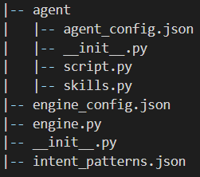
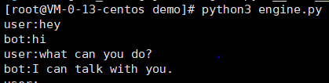

# Broca

Broca is a tiny and easy-to-use dialogue framework.

## Installation

    python setup.py install
    pip install -r quirements.txt

## Quickstart

Iinitializa a project by typing the following command:

    broca init --project_name demo
then a directory named demo which contains the project template will be generated. The directory tree is as follows:

The project contains an initial agent, which is defined in the 'agent' directory. 'engine_config.json' is the configuration file of the task engine; 'engine.py' defines the task engine;
'intent_patterns.json' defines the mapping of the intents and patterns.  
We now finish our demo by implementing two simple skills. Edit the skills.py as follows:

    from Broca.task_engine.skill import Skill

    class GreetSkill(Skill):
        def __init__(self):
            super().__init__()
            self.name = "greet_skill"
            self.trigger_intent = "greet"
            self.intent_patterns = ["hi", "hey", "hello"]

        def _perform(self, tracker):
            self.utter("hi", tracker.sender_id)
            return []

    class IntroductionSkill(Skill):
        def __init__(self):
            super().__init__()
            self.name = "introduce_skill"
            self.trigger_intent = "what_can_you_do"
            self.intent_patterns = ["what can you do?"]

        def _perform(self, tracker):
            self.utter("I can task with you.", tracker.sender_id)
            return []

Then we can test our demo just by running engine.py.

