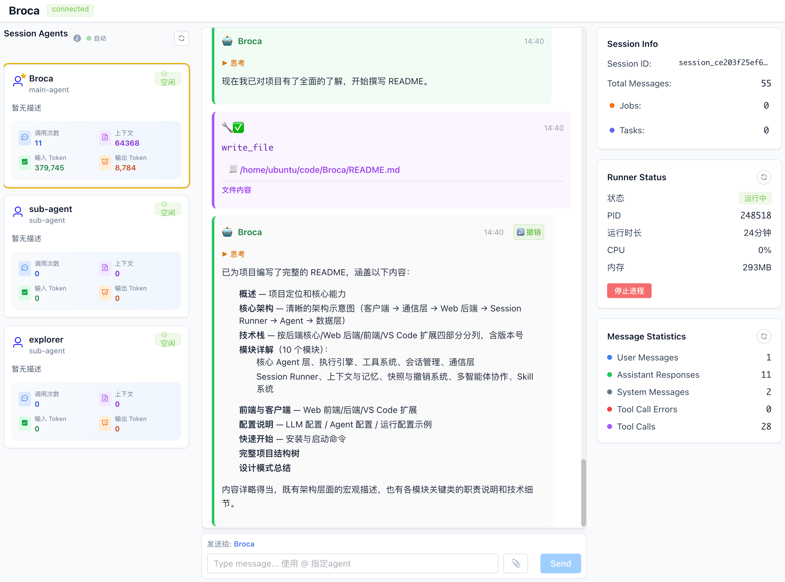
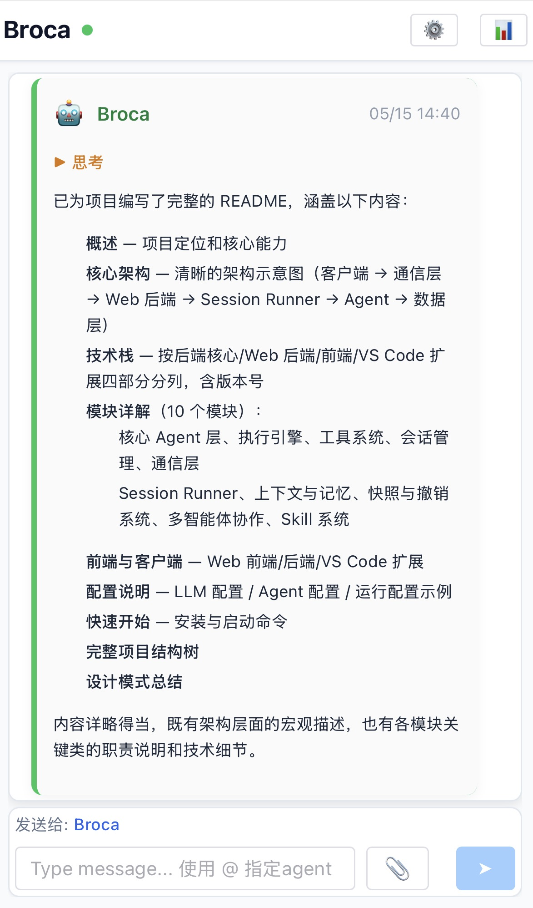
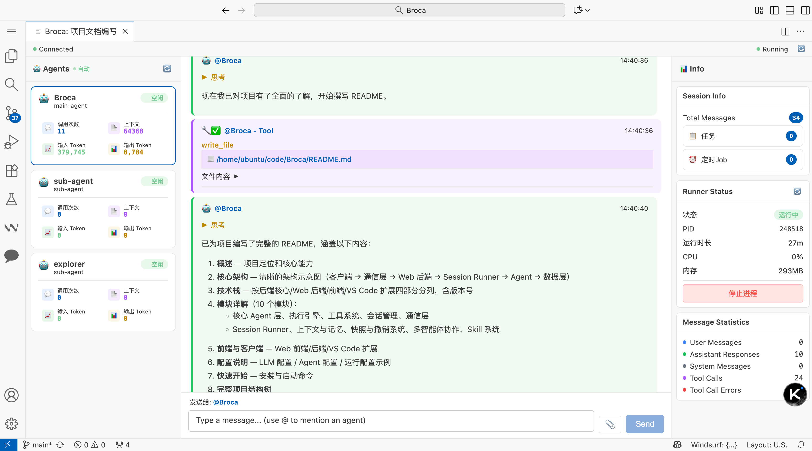

# Broca — 轻量级 Agent 框架

<div align="center">

**一个可扩展的智能体框架，支持多UI实时交互**

</div>

### PC端web界面


### 移动端web界面



### VS Code插件界面



---

## 目录

- [概述](#概述)
- [核心架构](#核心架构)
- [技术栈](#技术栈)
- [模块详解](#模块详解)
  - [1. 核心 Agent 层](#1-核心-agent-层)
  - [2. 执行引擎](#2-执行引擎)
  - [3. 工具系统](#3-工具系统)
  - [4. 会话管理](#4-会话管理)
  - [5. 通信层](#5-通信层)
  - [6. Session Runner](#6-session-runner)
  - [7. 上下文与记忆](#7-上下文与记忆)
  - [8. 快照与撤销系统](#8-快照与撤销系统)
  - [9. 多智能体协作](#9-多智能体协作)
  - [10. Skill 系统](#10-skill-系统)
  - [11. 命令系统](#11-命令系统)
- [前端与客户端](#前端与客户端)
  - [Web 前端](#web-前端)
  - [Web 后端](#web-后端)
  - [VS Code 扩展](#vs-code-扩展)
- [配置](#配置)
- [快速开始](#快速开始)
- [项目结构](#项目结构)

---

## 概述

Broca 是一个用 Python 构建的Agent系统，核心设计理念是 **模块化** 和 **可扩展**。它支持：

- **多LLM供应商**：通过 litellm 统一接入多种 LLM 提供商
- **实时通信**：基于 Socket.IO 实现浏览器/CLI/VS Code多端实时交互
- **子进程隔离**：每个会话在独立子进程中运行，支持心跳监控
- **快照与撤销**：基于Git的文件系统快照，实现操作级撤销/重做
- **上下文压缩**：智能管理长对话上下文，自动压缩过期内容
- **Skill插件系统**：通过 Markdown 文件定义可复用的技能
- **多客户端**：Web界面、CLI、VS Code 扩展
- **一键安装**：通过安装脚本一键安装，支持supervisor进行服务管理

---

## 核心架构

```
┌─────────────────────────────────────────────────────────────┐
│                      Client Layer                            │
│  ┌──────────┐  ┌──────────┐  ┌────────────┐  ┌──────────┐  │
│  │  Web UI  │  │   CLI    │  │ VS Code    │  │  API     │  │
│  │ (Vue 3)  │  │(Textual) │  │ Extension  │  │ (REST)   │  │
│  └────┬─────┘  └────┬─────┘  └─────┬──────┘  └────┬─────┘  │
│       │              │              │              │         │
├───────┴──────────────┴──────────────┴──────────────┴────────┤
│                    Communication Layer                       │
│              ┌──────────────────────────┐                    │
│              │   Socket.IO Server        │                    │
│              │  (multi-endpoint, room)   │                    │
│              └────────────┬─────────────┘                    │
├───────────────────────────┴──────────────────────────────────┤
│                     Web Backend (FastAPI)                     │
│  ┌──────────────┐  ┌──────────────┐  ┌──────────────────┐   │
│  │ REST API     │  │ RunnerManager │  │ SocketIO Runtime │   │
│  │ (sessions,   │  │ (子进程管理)    │  │                  │   │
│  │  files, etc) │  │ 心跳监控/重启   │  │                  │   │
│  └──────────────┘  └──────┬───────┘  └──────────────────┘   │
├───────────────────────────┴──────────────────────────────────┤
│                     Session Runner (子进程)                    │
│  ┌──────────────────────────────────────────────────────┐    │
│  │ ┌─────────┐ ┌─────────┐ ┌─────────────────────────┐ │    │
│  │ │ Agent A │ │ Agent B │ │     IPC Client           │ │    │
│  │ │ (主Agent)│ │ (子Agent)│ │  (Unix Socket/Pipe)     │ │    │
│  │ └────┬────┘ └────┬────┘ └─────────────────────────┘ │    │
│  │      │            │                                   │    │
│  │ ┌────┴────────────┴────────────────────────────────┐  │    │
│  │ │              Execution Engine                      │  │    │
│  │ │  ┌────────┐  ┌──────────┐  ┌────────────────┐    │  │    │
│  │ │  │LLM Call│  │Tool Exec │  │Context Manager  │    │  │    │
│  │ │  └────────┘  └──────────┘  └────────────────┘    │  │    │
│  │ └───────────────────────────────────────────────────┘  │    │
│  └──────────────────────────────────────────────────────┘    │
├──────────────────────────────────────────────────────────────┤
│                       Data Layer                              │
│  ┌────────────────┐  ┌────────────────┐  ┌──────────────┐   │
│  │ SQLite/SQLModel │  │  Git Snapshots  │  │ Session      │   │
│  │ (sessions,      │  │  (workspace     │  │ Memory       │   │
│  │  messages,      │  │  版本追踪)      │  │ (long-term)  │   │
│  │  agents)        │  │                │  │              │   │
│  └────────────────┘  └────────────────┘  └──────────────┘   │
└──────────────────────────────────────────────────────────────┘
```

---

## 技术栈

### 后端核心

| 技术 | 用途 |
|------|------|
| Python | 主语言 |
| [litellm](https://github.com/BerriAI/litellm) | 统一 LLM API 接入 |
| [SQLModel](https://sqlmodel.tiangolo.com/) | ORM + 数据建模 |
| [aiosqlite](https://github.com/omnilib/aiosqlite) | 异步 SQLite |
| [python-socketio](https://python-socketio.readthedocs.io/) | 实时通信 |
| [aiohttp](https://docs.aiohttp.org/) | 异步 HTTP | ≥ 3.11.0 |
| [Jinja2](https://jinja.palletsprojects.com/) | 模板渲染 |
| [APScheduler](https://apscheduler.readthedocs.io/) | 任务调度 |
| [GitPython](https://gitpython.readthedocs.io/) | Git 操作 |
| [Playwright](https://playwright.dev/python/) | Web 抓取 |

### Web 后端

| 技术 | 用途 |
|------|------|
| [FastAPI](https://fastapi.tiangolo.com/) | REST API 框架 |
| [Uvicorn](https://www.uvicorn.org/) | ASGI 服务器 |
| [Supabase](https://supabase.com/) | 用户认证与文件上传 |
| [Alembic](https://alembic.sqlalchemy.org/) | 数据库迁移 |

### 前端

| 技术 | 用途 |
|------|------|
| [Vue 3](https://vuejs.org/) | 前端框架 (Composition API) |
| [TypeScript](https://www.typescriptlang.org/) | 类型安全 |
| [Vite](https://vitejs.dev/) | 构建工具 |
| [Pinia](https://pinia.vuejs.org/) | 状态管理 |
| [Tailwind CSS](https://tailwindcss.com/) | 样式 |
| [Socket.IO Client](https://socket.io/) | 实时通信 |

### VS Code 扩展

| 技术 | 用途 |
|------|------|
| TypeScript | 开发语言 |
| VS Code API | 扩展框架 |
| Socket.IO Client | 实时通信 |

---

## 模块详解

### 1. 核心 Agent 层

**核心文件**: `broca/agent.py`, `broca/agent_manager.py`, `broca/agent_configs.py`

Agent 是系统的核心执行单元，每个 Agent 包含：

- **LLM Client**: 统一封装对不同 LLM 提供商的调用（流式/非流式）
- **Tool 集合**: 可配置的工具列表，支持内置工具和自定义工具
- **Context**: 管理对话历史和 system prompt 的组装
- **Communicator**: 通过 Socket.IO 实现消息收发
- **Session Memory**: 长期记忆管理
- **Permission Manager**: 用户交互式权限管理
- **Revert Service**: 撤销/重做支持

Agent 有三种运行状态：`idle`、`running`、`disconnected`。每个 Agent 拥有独立的 LLM Client 实例和统计数据追踪（token 用量、调用次数等）。

**AgentFactory**（单例）负责：
- 从配置文件加载 Agent 配置（YAML + Markdown 格式）
- 创建/恢复/缓存 Agent 实例
- 管理会话内的 Agent 集合

### 2. 执行引擎

**核心文件**: `broca/execution_engine.py`

ExecutionEngine 是 Agent 的执行核心，管理完整的执行生命周期：

```
消息输入 → 设置执行上下文 → 循环执行步骤 → 返回执行结果
```

每个步骤（Step）包含：
1. **LLM 调用**（支持流式输出，含推理内容）
2. **结果保存**（持久化到数据库）
3. **工具调用**（可配置超时，支持并发工具执行）
4. **快照捕获**（step 开始/结束）
5. **死循环检测**（连续 3 步相同工具调用模式）
6. **上下文压缩**（过期工具结果清理 + Session Memory 截断）

执行状态枚举：`RUNNING`、`PENDING`、`COMPLETED`、`ERROR`、`ABORTED`、`SKIPPED`、`LIMIT_EXCEEDED`、`DEAD_LOOP`

### 3. 工具系统

**核心文件**: `broca/tools/tool_manager.py`, `broca/tools/tool.py`

**自动发现机制**：ToolManager（单例）启动时自动扫描 `broca/tools/` 目录下的所有 Tool 子类并注册。每类工具对应一个 Python 文件，继承自 `Tool` 基类。

**分类**：

| 类别 | 工具 |
|------|------|
| **只读工具** | `read_file`, `glob`, `grep`, `list_dir`, `tree_dir`, `web_fetch`, `web_search`, `ask_user`, `task_management`, `todo_management`, `cron` |
| **修改工具** | `edit_file`, `write_file` |

- 工具名必须唯一，内置工具与自定义工具不可重名
- 支持 MCP（Model Context Protocol）工具加载
- 支持工作区自定义工具（`{workspace}/.broca/tool.py`）
- 允许配置 Agent 可用的工具白名单

### 4. 会话管理

**核心文件**: `broca/session/`

会话（Session）是对话的基本单元，每个会话包含：

- **Session**: 会话元信息（描述、工作区、创建时间）
- **Turn**: 对话轮次（一次用户输入 + Agent 完整的回应过程）
- **Message**: 消息（USER / ASSISTANT / TOOL / SYSTEM / TURN_START / TURN_END）
- **Agent / AgentConfig**: Agent 实例及其配置持久化

**数据库**：基于 SQLModel + aiosqlite 的异步 SQLite 数据库，支持 Alembic 迁移。

**消息模型**支持：
- 序列号排序
- 截断标记（`is_truncated`，被 Session Memory 替代的历史消息）
- 过期标记（`is_expired`，上下文压缩清理的工具结果）
- Step 级快照关联

**RevertService** 提供 undo/redo 能力，基于 Git 快照比对实现文件级变更回滚。

### 5. 通信层

**核心文件**: `broca/comm/socketio_server.py`

SocketIOServer 是一个多端通信服务器，支持：

- **多种客户端类型**: browser、CLI、VSCode、browser_plugin
- **消息路由**: 支持直接发送、订阅广播、房间广播
- **事件系统**: 可注册自定义事件处理器（connect、disconnect、message 等）
- **线程安全**: 使用 asyncio.Lock 保护共享状态

通信消息包含完整的元信息：消息类型、角色、发送者/接收者、订阅频道、错误码等。

### 6. Session Runner

**核心文件**: `broca/session_runner/`

将每个会话隔离在独立子进程中运行，提供：

- **RunnerManager**（Web 进程中的单例）：管理子进程生命周期
  - 启动/停止/重启会话进程
  - 心跳监控（默认 15s 检查，45s 超时）
  - 数据库持久化与恢复（启东时恢复活跃会话）
  - 并发限制（默认最大 10 个并发）
  - 事件系统（session_started / session_stopped / session_crashed）

- **IPC 通信**: 基于 Unix Socket（Linux/macOS）或 Named Pipe（Windows）
  - 控制命令：execute、abort、shutdown、status、get_stats
  - 事件通知：ready、heartbeat、status_change、error、completed

- **Runner 子进程**: 加载会话 → 连接 Socket.IO → 启动 Agent 消息循环 → 定期心跳

### 7. 上下文与记忆

**核心文件**: `broca/context.py`, `broca/context_compressor.py`, `broca/session_memory/`

**Context** 负责：
- 组装 system prompt（角色定义、环境信息、Skills、配置文件、记忆、用户画像）
- 管理对话历史与数据库 message_id 的映射
- 支持从数据库重建历史（过滤被截断/过期的消息）
- 在 Abort 时自动截断最后一次含工具调用的 Assistant 消息

**会话上下文压缩** 包含两种策略：
- **策略A**: 清理过期的工具执行结果，替换为占位符
- **策略B**: 基于 Session Memory 截断早期对话，释放上下文窗口

**Session Memory** 实现长期记忆：
- 在上下文中注入历史摘要
- 每次 LLM 调用后自动检查并提取关键信息

### 8. 快照与撤销系统

**核心文件**: `broca/snapshot/`

基于 Git 实现文件系统快照：
- **SnapshotTracker**: 捕获工作区文件快照（Git 树哈希）
- **PatchCalculator**: 计算两个快照间的文件变更差异
- **GitManager**: 管理 Git 仓库（初始化、忽略规则同步）
- **Restore**: 基于快照恢复文件状态

每个 Agent Step 包含起始和结束两个快照，支持：
- 操作级撤销（回滚到指定消息前的状态）
- 操作级重做
- 变更摘要展示

### 9. 多智能体编排

**核心文件**: `broca/orchestration/`

Broca 提供 6 种编排拓扑，支持将多个 Agent 组合为复杂工作流。编排器通过 **共享黑板（Blackboard）** 实现 Agent 间状态共享，Agent 通过内置工具（`task_management`、`write_blackboard`）自主协作，无需编排器"推送"任务。

#### 9.1 拓扑总览

| 拓扑 | 说明 | 适用场景 |
|------|------|----------|
| **Pipeline** | 流水线顺序执行，支持 5 种步骤类型 | 有明确步骤的工作流 |
| **Supervisor-Worker** | 主管分解任务，工人执行，主管检查/迭代 | 需要分工协作和质量把控 |
| **Round-Table** | 多轮圆桌讨论，Moderator 控制节奏 | 头脑风暴、辩论、集体决策 |
| **Broadcast** | Dispatcher 分解任务，Worker 并行执行，Aggregator 汇聚 | 多角度分析同一问题 |
| **Consensus** | 多个 Reviewer 独立评分，按策略聚合 | 代码审查、方案评估 |
| **Composite** | 组合嵌套多种拓扑 | 复杂工作流编排 |

#### 9.2 核心概念

**共享黑板（Blackboard）**
所有编排器共享同一个 Blackboard 实例，Agent 通过 `write_blackboard` / `read_blackboard` 工具读写。黑板支持：
- 嵌套路径（`pipeline.step_1.output`）
- 版本化管理（每次写入生成新版本）
- 变更事件通知

**工具驱动（Tool-Driven）**
编排器通过 Agent 的内置工具（`task_management`、`write_blackboard`）驱动协作，而非解析 LLM 的文本输出：
- 调度者（Dispatcher/Supervisor）通过 `task_management.create` 创建任务
- 将 `{worker_name: task_id}` 映射通过 `write_blackboard` 写入黑板
- Worker 自主从黑板读取 task_id，用 `task_management.get` 获取详情后执行
- 执行完成后通过 `task_management.update` 标记完成

**停止约定（Stop Convention）**
Agent 通过黑板约定请求停止整个编排：
- Agent 调用 `write_blackboard(key="orchestration.stop", value={"reason": "..."})`
- 编排器在每个 Agent 执行完毕后检查黑板，发现信号则调用 `abort()` 优雅终止
- 信号自动清除，防止重复触发

**共享并行执行器**
所有编排器共用 `execute_agents_in_parallel()` 函数，通过 `asyncio.gather` 并行执行 Agent 任务，每个 Agent 独立容错。

#### 9.3 Pipeline 流水线

Pipeline 是最灵活的拓扑，支持 5 种步骤类型，可在一个 YAML 中表达复杂工作流。

**步骤类型**：

| 类型 | 说明 | 执行方式 |
|------|------|----------|
| `task` | 单 Agent 顺序执行 | 串行 |
| `fan-out` | 扇出并行分发到多个 Agent 或子 Crew | `asyncio.gather` |
| `fan-in` | 汇聚多个分支结果 | concat / merge / agent |
| `condition` | 条件分支判断 | 静态比较 / Agent 评估 |
| `switch` | 多路分支匹配 | 静态匹配 / Agent 评估 |

**YAML 示例**：

```yaml
orchestrator:
  type: pipeline
  extras:
    steps:
      # 普通任务
      - agent: "代码审查员"
        task: "审查代码质量"

      # 扇出：三个维度并行分析
      - type: fan-out
        name: "并行分析"
        branches:
          - name: "安全审计"
            agent: "安全审计员"
            task: "检查安全漏洞"
          - name: "性能分析"
            agent: "性能分析员"
            task: "分析性能瓶颈"
          - name: "风格检查"
            crew:                         # 分支也可运行子编排器
              type: pipeline
              steps:
                - agent: "风格检查员"
                  task: "检查代码风格"
                - agent: "质量管理员"
                  task: "汇总质量报告"

      # 扇入：汇聚所有结果
      - type: fan-in
        name: "结果汇聚"
        aggregation_strategy: agent
        aggregator: "质量管理员"
        task: "综合各维度分析结果"

      # 条件分支：Agent 评估决策
      - type: condition
        name: "决策分支"
        evaluator: "质量管理员"
        evaluation_prompt: |
          根据审查结果判断是否可以自动批准。
          考虑：安全风险、代码质量、缺陷严重性。
        branches:
          - name: "自动批准"
            agent: "集成管理员"
            task: "执行自动合并"
          - name: "需人工处理"
            agent: "集成管理员"
            task: "通知开发人员"

      # Switch 多路分支
      - type: switch
        name: "优先级处理"
        evaluator: "项目经理"
        evaluation_prompt: "根据结果决定处理优先级"
        branches:
          - name: "紧急"
            agent: "通知代理"
            task: "发送紧急通知"
          - name: "普通"
            agent: "通知代理"
            task: "记录到 Sprint Backlog"
          - name: "低优先级"
            agent: "通知代理"
            task: "记录到技术债务"
        default_branch: "普通"
```

**Condition 评估模式**：

```yaml
# Agent 评估模式（推荐）：LLM 根据上下文判断
- type: condition
  evaluator: "质量管理员"
  evaluation_prompt: "判断代码质量是否达标"

# 静态比较模式：简单的值比较
- type: condition
  condition_field: "score"
  condition_operator: "gte"
  condition_value: 0.7
```

支持运算符：`eq` / `ne` / `gt` / `gte` / `lt` / `lte` / `contains` / `startswith` / `endswith`

**Fan-in 汇聚策略**：

| 策略 | 说明 |
|------|------|
| `concat` | 将所有结果拼接为一个字符串 |
| `merge` | 合并为一个 dict |
| `agent` | 由指定的 Aggregator Agent 调用 LLM 汇聚 |

#### 9.4 Supervisor-Worker 主管-工人

Supervisor Agent 通过工具创建子任务，Worker 自主拉取，Supervisor 做质量检查和最终合成。

```yaml
orchestrator:
  type: supervisor-worker
  max_rounds: 3

agents:
  - role: supervisor
    name: "研究主管"
    config: supervisor.md
  - role: worker
    name: "文献研究员"
    config: researcher.md
  - role: worker
    name: "数据分析师"
    config: analyst.md
  - role: worker
    name: "报告撰写人"
    config: writer.md
```

执行流程：
```
Supervisor (task_management.create + write_blackboard)
  → Worker 自主拉取任务并执行
    → Supervisor LLM 质量检查 (PASS/FAIL)
      → 达标 → Supervisor LLM 合成最终报告
      → 不达标 → 下一轮迭代
```

#### 9.5 Round-Table 圆桌讨论

多个参与者围绕议题进行多轮发言，支持三种发言顺序和可选的主持人开场/结束语。

```yaml
orchestrator:
  type: round-table
  max_rounds: 3
  extras:
    moderator_opening: true      # 主持人开场语
    moderator_closing: true      # 主持人结束语
    speaker_order: moderator     # 发言顺序

agents:
  - role: moderator
    name: "主持人"
    config: moderator.md
  - role: participant
    name: "正方"
    config: pro.md
    extras:
      stance: pro
  - role: participant
    name: "反方"
    config: con.md
    extras:
      stance: con
```

**发言顺序模式**：

| 模式 | 说明 |
|------|------|
| `fixed` | 按配置顺序发言（默认） |
| `random` | 每轮随机打乱 |
| `moderator` | Moderator Agent 根据讨论进展决定每轮顺序 |

#### 9.6 Broadcast 广播

Dispatcher Agent 通过工具创建子任务，Worker 自主拉取执行，Aggregator 汇聚结果。

```yaml
orchestrator:
  type: broadcast

agents:
  - role: dispatcher
    name: "分析主管"
    config: dispatcher.md
  - role: worker
    name: "市场分析师"
    config: market_analyst.md
  - role: worker
    name: "技术评估员"
    config: tech_evaluator.md
  - role: aggregator
    name: "报告撰写员"
    config: aggregator.md
```

执行流程：
```
Dispatcher (task_management.create + write_blackboard)
  → Worker 自主拉取任务并执行
    → Aggregator LLM 汇聚结果
```

#### 9.7 Consensus 共识

多个 Reviewer 独立评分，按策略聚合，可选 Adjudicator LLM 综合评议。

```yaml
orchestrator:
  type: consensus
  strategy: average        # average / majority / unanimous / weighted
  threshold: 0.7           # 通过阈值
  weights:                 # weighted 策略的权重
    reviewer_a: 1.5
    reviewer_b: 1.0

agents:
  - role: reviewer
    name: "评审员A"
    config: reviewer.md
  - role: reviewer
    name: "评审员B"
    config: reviewer.md
  - role: adjudicator       # 可选：LLM 综合评议
    name: "决策者"
    config: adjudicator.md
```

**聚合策略**：

| 策略 | 算法 |
|------|------|
| `average` | 平均分 >= 阈值 |
| `majority` | 超过半数通过 |
| `unanimous` | 全部通过 |
| `weighted` | 加权平均 >= 阈值 |

#### 9.8 Composite 组合嵌套

Composite 可以将其他拓扑组合使用，支持四种执行模式：

```yaml
orchestrator:
  type: composite

  # 子 Crew 执行方式由 type 决定
  # pipeline:          串行执行所有子 Crew
  # supervisor-worker: 串行 + supervisor phase
  # broadcast:         并行执行所有子 Crew
  # (其他):            串行

  extras:
    # broadcast 模式专用：
    aggregator: "项目经理"          # 扇入汇聚（并行完成后执行）
    aggregator_prompt: "综合结果"
    follow_up:                      # 后续串行步骤
      - name: "最终决策"
        orchestrator:
          type: consensus
        agents: [...]

sub_crews:
  - name: "市场分析"
    orchestrator:
      type: pipeline
    agents:
      - role: worker
        name: "市场研究员"
        config: researcher.md
    steps:
      - agent: "市场研究员"
        task: "分析市场趋势"

  - name: "技术评估"
    orchestrator:
      type: pipeline
    agents:
      - role: worker
        name: "技术评估员"
        config: evaluator.md
    steps:
      - agent: "技术评估员"
        task: "评估技术可行性"
```

#### 9.9 完整工作流示例

以下示例展示 6 种拓扑组合的复杂编排：

```yaml
name: "产品发布决策全流程"
orchestrator:
  type: pipeline
  extras:
    steps:
      # Step 1-2: 顺序准备
      - agent: "数据工程师"
        task: "准备数据"
      - agent: "分析师"
        task: "初步分析"

      # Step 3: 扇出 — 市场和技术并行分析
      - type: fan-out
        name: "并行分析"
        branches:
          - name: "市场分析"
            crew:
              type: pipeline
              steps:
                - agent: "市场研究员"
                  task: "分析市场趋势"
                - agent: "竞品分析师"
                  task: "分析竞争对手"
          - name: "技术评估"
            crew:
              type: pipeline
              steps:
                - agent: "技术评估员"
                  task: "技术可行性评估"
                - agent: "安全审计员"
                  task: "安全风险评估"

      # Step 4: 扇入 — 汇聚
      - type: fan-in
        aggregation_strategy: agent
        aggregator: "项目经理"
        task: "综合双方分析结果"

      # Step 5-6: 顺序后续
      - agent: "决策者"
        task: "做出最终决策"
      - agent: "报告撰写员"
        task: "撰写综合报告"
```

完整执行流程：
```
数据准备 → 初步分析
  → [并行] 市场分析(pipeline) ─┐
  → [并行] 技术评估(pipeline) ─┤
                               ├─→ 项目经理汇聚
                                  → 决策者决策 → 撰写报告
```


### 10. Skill 系统

**核心文件**: `broca/skill_manager.py`, `skills/`

Skill 是可复用的能力单元，以 Markdown 文件定义：
- **YAML 头部**: 技能名称、描述等元信息
- **Markdown 正文**: 技能详细规范（注入到 system prompt 中）
- **加载路径**: 全局 (`~/.agents/skills/`) 或项目内 (`skills/`, `.agents/skills/`)
- **Workspace 覆盖**: 工作区技能可扩展全局技能

### 11. 命令系统

**核心文件**: `broca/commands/`

命令系统提供了一种通过聊天的 `/` 触发快捷操作的方式，类似 Claude Code 的命令设计。

#### 命令类型

| 类型 | 说明 | 示例 |
|------|------|------|
| **LocalCommand** | 在 Agent 进程内本地执行，不涉及 LLM 调用 | `/help`, `/abort`, `/undo`, `/redo` |
| **PromptCommand** | 构造提示词后调用 LLM 执行，可生成流式回复 | `/ask`, `/plan`, `/init` |

#### 架构

```
命令输入 (/help)
     │
     ▼
parse_command_input() ── 解析 / 前缀
     │
     ▼
CommandRegistry ── 查找命令定义
     │
     ▼
dispatch_command()
     ├── LocalCommand  →  execute() 本地执行
     └── PromptCommand →  build_prompt() → agent.run() LLM 执行
```

- **CommandBase**: 所有命令的基类，定义 `name`、`description`、`type`、`is_hidden`、`is_enabled`、`show_result` 等元属性
- **CommandRegistry**: 命令注册中心，按名称注册/查找/列出命令
- **CommandLoader**: 自动扫描 `broca/commands/` 目录加载命令（每个命令一个子目录，含 `command.md` 和 `__init__.py`）
- **CommandManager**: 集成注册、加载、分发，挂载在 Agent 上

#### 命令定义规范

每个命令定义在一个子目录中，包含两个文件：

**`command.md`** — YAML 头部 + Markdown 正文（PromptCommand 的提示词模板）：

```yaml
---
name: help
description: Show available commands
argument_hint: "[command_name]"
type: local
is_hidden: false
is_enabled: true
show_result: true
---
```

**`__init__.py`** — 命令实现类：

```python
from broca.commands.base import LocalCommand, CommandContext, CommandResult

class HelpCommand(LocalCommand):
    async def execute(self, args: str, ctx: CommandContext) -> CommandResult:
        ...
        return CommandResult(type="text", value="## Available Commands\n...")
```

#### 可用命令

| 命令 | 类型 | 说明 |
|------|------|------|
| `/help` | local | 显示可用命令列表或某个命令的详细信息 |
| `/abort` | local | 中止当前 Agent 执行（隐藏，不显示在补全中） |
| `/undo` | local | 撤销上一步操作（隐藏） |
| `/redo` | local | 重做上一次撤销的操作（隐藏） |
| `/ask` | prompt | 回答问题模式，不做任何文件修改 |
| `/init` | prompt | 初始化项目，扫描工作区并生成 `.agents/AGENTS.md` 概要 |
| `/plan` | prompt | 根据用户目标制定进化计划并形成文档，不执行 |

#### 前端集成

Web 前端和 VS Code 扩展均支持 `/` 命令补全：

- 输入 `/` 自动弹出命令建议列表
- 支持前缀匹配（`/pl` → `plan`）
- 通过 `↑↓` 导航、`Enter` 选择、`Esc` 关闭
- 每个命令项显示名称、描述和类型标签（local/prompt）
- 命令列表优先从后端 API `GET /api/commands` 获取，API 不可用时使用静态列表兜底

#### 自定义命令

在工作区 `.broca/commands/` 目录下创建命令子目录即可自动加载：

```
your-project/
└── .broca/
    └── commands/
        └── deploy/
            ├── command.md
            └── __init__.py
```

自定义命令不会覆盖内置命令，且支持所有标准元属性配置。

---

## 前端与客户端

### Web 前端

`broca-web/frontend/` — Vue 3 + TypeScript 单页应用

- **页面**：Auth（登录）、Chat（对话）、Sessions（会话管理）、Files（文件浏览）、Jobs（任务）、Tasks（任务看板）
- **组件**：消息列表、输入框、Agent 侧边栏、权限对话框、文件预览等
- **状态管理**：Pinia stores（chat、session、agent、socket、task、user）
- **实时通信**：Socket.IO 客户端订阅 Agent 消息流
- **特性**：Markdown 渲染、代码高亮、文件拖拽上传、主题切换

### Web 后端

`broca-web/backend/` — FastAPI REST API 服务

- **API 路由**：sessions、agents、files、tasks、jobs、user
- **SocketIO Runtime**：集成 Broca SocketIO Server 运行时
- **认证**：Supabase JWT token 验证
- **Runner 集成**：管理 Session Runner 子进程

### VS Code 扩展

`broca-vscode/` — TypeScript 扩展

- 自定义 Chat Webview
- VS Code API 集成
- Socket.IO 实时通信
- 会话管理树视图

---

## 配置

### LLM 配置

`configs/llm_config.json` — 定义 LLM 提供商和模型：

```json
{
  "nvidia": {
    "base_url": "https://integrate.api.nvidia.com/v1",
    "api_key": "...",
    "qwen3.5": {
      "model": "openai/qwen/qwen3.5-397b-a17b",
      "temperature": 0.5,
      "modality": {"text": "", "image": {}, "video": {"fp": 2}}
    }
  }
}
```

### Agent 配置

`configs/agents/*.md` — YAML + Markdown 格式：

```yaml
---
name: Broca
role: main-agent
tools: ask_user,assign_task,edit_file,glob,grep,read_file,...
skills: all
---
## Role
...
```

### 运行配置

`configs/configs.json` — 数据库目录、日志等全局配置。

---

## 快速开始

### 环境要求

| 依赖 | 最低版本 | 说明 |
|------|:--------:|------|
| Python | ≥ 3.12 | 主语言 |
| pnpm | 任意版本 | Web 前端构建（可降级 npm） |
| Node.js | ≥ 18 | 前端构建 |
| nginx | 任意版本 | **可选** — 生产环境推荐 |

### 一键安装（生产环境）

```bash
# 克隆项目
git clone <repo-url> && cd broca

# 一键安装
sh scripts/install.sh
```

安装脚本会依次执行：

| 步骤 | 内容 |
|:----:|------|
| 1/8 | 检查系统依赖（Python、pnpm、nginx） |
| 2/8 | 安装 broca Python 模块 + supervisor |
| 3/8 | 创建数据库并执行迁移（`~/.broca/data/`） |
| 4/8 | 配置文件上传存储（可选，支持 Cloudflare R2 / Supabase S3） |
| 5/8 | 安装前端依赖并构建 |
| 6/8 | 配置 nginx 站点（生成代理配置 + 部署静态文件） |
| 7/8 | 生成 supervisor 进程管理配置 |
| 8/8 | 完成安装 |

安装目录结构：

```
~/.broca/
├── data/
│   ├── sessions.db        # broca 主数据库（会话、消息、Agent）
│   └── backend.db         # 后端数据库（用户、认证）
├── logs/
│   ├── supervisord.log
│   ├── backend.out.log
│   └── frontend.out.log
├── supervisor/
│   └── supervisord.conf   # supervisor 配置
├── run/
│   └── supervisord.pid
├── install.json           # 安装信息
└── nginx-broca.conf       # nginx 配置
```

### 服务管理

```bash
# 启动所有生产服务
broca service start

# 查看服务状态
broca service status

# 重启服务
broca service restart

# 停止服务
broca service stop
```

### 开发模式

```bash
# 同时启动前端 + 后端（热重载）
broca web
```

### 部署架构

```
浏览器 ──→ nginx(:5166) ──proxy──→ FastAPI(:9000)    REST API
                        ──proxy──→ Socket.IO(:6868)  实时通信
                        ──static──→ /var/www/broca/frontend/  前端静态文件
```

**单端口访问**，只需放行 5166 端口。WebSocket 代理自动处理跨域。

### 访问

- Web 界面：`http://localhost:5166`
- REST API：`http://localhost:9000/api/`
- Socket.IO：`http://localhost:6868`

---

## 项目结构

```
broca/
├── broca/                          # 核心 Python 包
│   ├── cli/                        # CLI 入口
│   │   └── main.py                 # 命令行解析与服务启动
│   ├── comm/                       # 通信层
│   │   ├── socketio_server.py      # Socket.IO 服务端
│   │   ├── socketio_client.py      # Socket.IO 客户端
│   │   └── agent_communicator.py   # Agent 通信接口
│   ├── session/                    # 会话管理
│   │   ├── database.py             # 数据库连接
│   │   ├── models.py               # 数据模型
│   │   ├── service.py              # CRUD 服务
│   │   ├── session_manager.py      # 会话管理器
│   │   ├── revert_service.py       # 撤销/重做服务
│   │   └── db_migration.py         # 数据库迁移
│   ├── session_memory/             # 长期记忆
│   │   ├── memory_manager.py       # 记忆管理器
│   │   └── memory_prompts.py       # 记忆提示词
│   ├── session_runner/             # 子进程 Runner
│   │   ├── manager.py              # 进程管理器
│   │   ├── runner.py               # 子进程入口
│   │   ├── ipc.py                  # 进程间通信
│   │   ├── models.py               # 数据结构
│   │   └── heartbeat.py            # 心跳监控
│   ├── snapshot/                   # 快照系统
│   │   ├── git_manager.py          # Git 操作
│   │   ├── track.py                # 快照捕获
│   │   ├── patch.py                # 变更计算
│   │   └── restore.py              # 文件恢复
│   ├── tools/                      # 工具系统
│   │   ├── tool.py                 # 工具基类
│   │   ├── tool_manager.py         # 工具管理器
│   │   ├── filesystem.py           # 文件操作工具
│   │   ├── web.py                  # 网络工具
│   │   ├── memory.py               # 记忆工具
│   │   ├── bash.py                 # 命令执行工具
│   │   ├── skill.py                # 技能加载工具
│   │   ├── task.py                 # 任务管理工具
│   │   ├── cron.py                 # 定时任务工具
│   │   └── ...                     # 其他工具
│   ├── agent.py                    # Agent 类
│   ├── agent_configs.py            # Agent 配置
│   ├── agent_crew.py               # 多 Agent 协作
│   ├── agent_manager.py            # Agent 工厂
│   ├── orchestration/              # 多 Agent 编排系统
│   │   ├── orchestrator.py         # 编排器基类 + 共享执行器
│   │   ├── crew.py                 # 编排数据结构 (CrewConfig/拓扑/角色)
│   │   ├── pipeline.py             # Pipeline 流水线（5 种步骤类型）
│   │   ├── supervisor_worker.py    # Supervisor-Worker 主管-工人
│   │   ├── round_table.py          # Round-Table 圆桌讨论
│   │   ├── broadcast.py            # Broadcast 广播分发
│   │   ├── consensus.py            # Consensus 共识评估
│   │   ├── composite.py            # Composite 组合嵌套
│   │   ├── blackboard.py           # 共享黑板
│   │   ├── prompt_loader.py        # Jinja2 提示词模板加载器
│   │   └── prompts/                # 按拓扑分组的提示词模板
│   ├── execution_engine.py         # 执行引擎
│   ├── commands/                   # 命令系统
│   │   ├── base.py                 # 命令基类（CommandBase/LocalCommand/PromptCommand）
│   │   ├── registry.py             # 命令注册中心
│   │   ├── loader.py               # 命令自动加载器
│   │   ├── dispatcher.py           # 命令分发器
│   │   ├── manager.py              # 命令管理器
│   │   ├── builtin/                # 内置本地命令（help/abort/undo/redo）
│   │   └── prompt/                 # 内置提示命令（init/plan/ask）
│   ├── execution_engine.py         # 执行引擎
│   ├── context.py                  # 上下文管理
│   ├── context_compressor.py       # 上下文压缩
│   ├── llm.py                      # LLM 客户端
│   ├── skill_manager.py            # Skill 管理器
│   ├── scheduler.py                # 任务调度器
│   ├── permission_manager.py       # 权限管理
│   ├── error_handler.py            # 错误处理
│   └── configs.py                  # 全局配置
├── broca-web/                      # Web 应用
│   ├── backend/                    # FastAPI 后端
│   │   ├── app/
│   │   │   ├── api/                # REST API 路由
│   │   │   ├── core/               # 核心配置（SocketIO、DB）
│   │   │   ├── models/             # 数据模型
│   │   │   ├── schemas/            # Pydantic schema
│   │   │   ├── services/           # 业务服务
│   │   │   └── main.py             # 应用入口
│   │   ├── alembic/                # 数据库迁移脚本
│   │   ├── alembic.ini             # Alembic 配置（路径动态）
│   │   └── pyproject.toml
│   └── frontend/                   # Vue 3 前端
│       └── src/
│           ├── api/                # API 客户端
│           ├── components/         # UI 组件
│           ├── stores/             # Pinia 状态
│           ├── views/              # 页面视图
│           └── utils/              # 工具函数
├── broca-vscode/                   # VS Code 扩展
│   └── src/
│       ├── extension/              # 扩展主逻辑
│       └── webview/                # Chat Webview
├── configs/                        # 配置文件
│   ├── configs.json                # 全局配置
│   ├── llm_config.json             # LLM 配置
│   └── agents/                     # Agent 配置
├── skills/                         # 内置 Skills
├── tests/                          # 测试
├── docs/                           # 文档
└── pyproject.toml                  # 项目元数据
```

---

## 设计模式

| 模式　　　　　　　　　　| 使用场景　　　　　　　　　　　　　　　　　　　　　　　　　　　　　　　　　　 |
| -------------------------| ------------------------------------------------------------------------------|
| **单例 (Singleton)**　　| ToolManager、SkillManager、AgentFactory、RunnerManager、AsyncDatabaseManager |
| **观察者 (Observer)**　 | Socket.IO 事件系统、RunnerManager 事件　　　　　　　　　　　　　　　　　　　 |
| **策略 (Strategy)**　　 | 插件式工具系统、LLM 多提供商抽象　　　　　　　　　　　　　　　　　　　　　　 |
| **工厂 (Factory)**　　　| AgentFactory 创建/恢复 Agent　　　　　　　　　　　　　　　　　　　　　　　　 |
| **代理 (Proxy)**　　　　| IPC 子进程管理　　　　　　　　　　　　　　　　　　　　　　　　　　　　　　　 |
| **模板方法 (Template)** | 执行步骤生命周期 (capture → LLM → tool → compress)　　　　　　　　　　　　　 |

---
