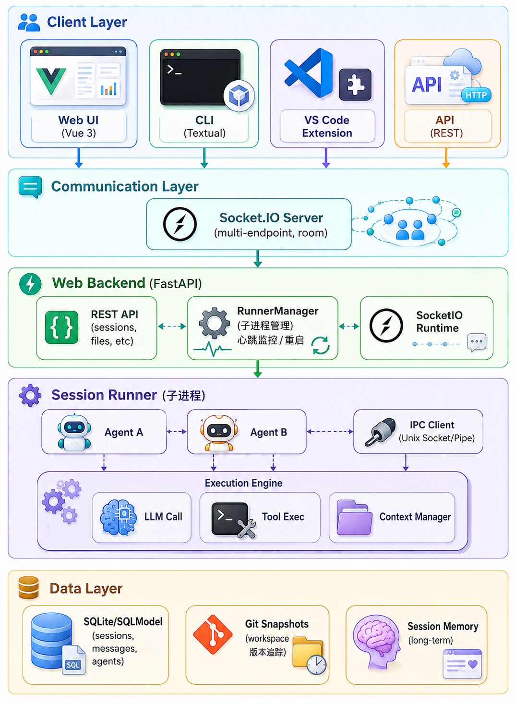

# Broca — 轻量级 Agent 框架

<div align="center">

**一个可扩展的智能体框架，支持多UI实时交互**

</div>

### PC端web界面


### 移动端web界面


### VS Code插件界面


---

## 目录

- [概述](#概述)
- [快速开始](#快速开始)
  - [环境要求](#环境要求)
  - [一键安装](#一键安装)
  - [服务管理](#服务管理)
  - [部署架构](#部署架构)
  - [访问](#访问)
  - [VS Code 扩展安装](#vs-code-扩展安装)
- [核心架构](#核心架构)
- [技术栈](#技术栈)
- [模块详解](#模块详解)
  - [1. 核心 Agent 层](#1-核心-agent-层)
  - [2. 执行引擎](#2-执行引擎)
  - [3. 工具系统](#3-工具系统)
  - [4. 会话管理](#4-会话管理)
  - [5. 通信层](#5-通信层)
  - [6. Session Runner](#6-session-runner)
  - [7. 上下文与记忆](#7-上下文与记忆)
  - [8. 快照与撤销系统](#8-快照与撤销系统)
  - [9. 多智能体编排](#9-多智能体编排)
  - [10. Skill 系统](#10-skill-系统)
  - [11. 命令系统](#11-命令系统)
- [前端与客户端](#前端与客户端)
  - [Web 前端](#web-前端)
  - [Web 后端](#web-后端)
  - [VS Code 扩展](#vs-code-扩展)
- [配置](#配置)
- [项目结构](#项目结构)

---

## 概述

Broca 是一个用 Python 构建的Agent系统，核心设计理念是 **模块化** 和 **可扩展**。它支持：

- **多LLM供应商**：通过 litellm 统一接入多种 LLM 提供商
- **实时通信**：基于 Socket.IO 实现浏览器/CLI/VS Code多端实时交互
- **子进程隔离**：每个会话在独立子进程中运行，支持心跳监控
- **快照与撤销**：基于Git的文件系统快照，实现操作级撤销/重做
- **上下文压缩**：智能管理长对话上下文，自动压缩过期内容
- **Skill插件系统**：通过 Markdown 文件定义可复用的技能
- **多客户端**：Web界面、VS Code 扩展
- **多智能体编排**：4 种拓扑（Pipeline/Supervisor-Worker/Round-Table/Composite），基于有向图（Graph）驱动，共享黑板通信，支持 static/agent 路由、并行扇出/汇聚、条件跳转、循环控制、人在环路（HITL）
- **一键安装**：通过安装脚本一键安装，支持supervisor进行服务管理

---

## 快速开始

### 环境要求

| 依赖　　| 最低版本 | 说明　　　　　　　　　　　 |
| ---------| :--------:| ----------------------------|
| Python　| ≥ 3.12　 | 主语言　　　　　　　　　　 |
| pnpm　　| 任意版本 | Web 前端构建（可降级 npm） |
| Node.js | ≥ 18　　 | 前端构建　　　　　　　　　 |
| nginx　 | 任意版本 | 部署前端需要　　　　　　　 |
### 一键安装

```bash
# 克隆项目
git clone <repo-url> && cd broca

# 一键安装
sh scripts/install.sh
```

安装脚本会依次执行：

| 步骤　| 内容　　　　　　　　　　　　　　　　　　　　　　　　　　　 |
| :-----:| ------------------------------------------------------------|
| 1/10　| 检查系统依赖（Python ≥3.12、pnpm、nginx）　　　　　　　　　|
| 2/10　| 安装 broca Python 模块 + supervisor　　　　　　　　　　　　|
| 3/10　| 数据库迁移（broca 主数据库 + 后端数据库）　　　　　　　　　|
| 4/10　| 创建管理员账户（交互式）　　　　　　　　　　　　　　　　　 |
| 5/10　| 配置文件上传存储（可选，支持 Cloudflare R2 / Supabase S3） |
| 6/10　| 安装前端依赖并构建　　　　　　　　　　　　　　　　　　　　 |
| 7/10　| 打包 VS Code 插件　　　　　　　　　　　　　　　　　　　　　|
| 8/10　| 配置 nginx 站点（生成代理配置 + 部署静态文件）　　　　　　 |
| 9/10　| 创建 supervisor 进程管理配置　　　　　　　　　　　　　　　 |
| 10/10 | 完成安装　　　　　　　　　　　　　　　　　　　　　　　　　 |

安装目录结构：

```
~/.broca/
├── configs/
│   ├── configs.json              # 全局配置
│   ├── llm_config_template.json           # LLM 配置
│   ├── tool_permission_config.json # 工具权限配置
│   └── agents/                   # Agent 角色配置
├── data/
│   ├── sessions.db               # broca 主数据库（会话、消息、Agent）
│   └── backend.db                # 后端数据库（用户、认证）
├── web/
│   ├── backend/                  # FastAPI 后端代码
│   └── frontend/                 # Vue 3 前端源码
├── logs/
│   ├── supervisord.log
│   ├── backend.out.log
│   └── frontend.out.log
├── supervisor/
│   └── supervisord.conf          # supervisor 配置
├── run/
│   └── supervisord.pid
├── install.json                  # 安装信息
└── nginx-broca.conf              # nginx 配置
```

**注意**: 首次安装需要将~/.broca/configs/llm_config_template.json改成llm_config.json，并填写相关api key。

### 服务管理

```bash
# 启动所有生产服务
broca service start

# 查看服务状态
broca service status

# 重启服务
broca service restart

# 停止服务
broca service stop
```


### 部署架构

```
浏览器 ──→ nginx(:5166) ──proxy──→ FastAPI(:9000)    REST API
                        ──proxy──→ Socket.IO(:6868)  实时通信
                        ──static──→ /var/www/broca/frontend/  前端静态文件
```

**单端口访问**，只需放行 5166 端口。WebSocket 代理自动处理跨域。

### 访问

- Web 界面：`http://localhost:5166`
- REST API：`http://localhost:9000/api/`
- Socket.IO：`http://localhost:6868`

### VS Code 扩展安装

安装脚本会自动打包 VS Code 插件，生成 `.vsix` 文件。安装方式如下：

**方式一：通过 VS Code 界面安装（推荐）**

1. 打开 VS Code
2. 点击左侧活动栏的 **Extensions** 图标（或按 `Ctrl+Shift+X`）
3. 点击扩展面板右上角的 `...` 菜单，选择 **Install from VSIX...**
4. 选择 `broca-vscode/broca-chat-0.1.0.vsix` 文件

**方式二：通过命令行安装**

```bash
code --install-extension broca-vscode/broca-chat-0.1.0.vsix
```

安装完成后，VS Code 左侧活动栏会出现 Broca 图标，点击即可使用。

**配置连接**：安装后需要配置 Broca 后端地址（默认为 `http://localhost:8000`）和 WebSocket 地址（默认为 `http://localhost:6868`），可在 VS Code 设置中搜索 `broca` 进行配置。

---

## 核心架构


---

## 技术栈

### 后端核心

| 技术　　　　　　　　　　　　　　　　　　　　　　　　　　　 | 用途　　　　　　　　　　　 |          |
| ------------------------------------------------------------| ----------------------------| ----------|
| Python　　　　　　　　　　　　　　　　　　　　　　　　　　 | 主语言　　　　　　　　　　 |          |
| [litellm](https://github.com/BerriAI/litellm)　　　　　　　| 统一 LLM API 接入　　　　　|          |
| [SQLModel](https://sqlmodel.tiangolo.com/)　　　　　　　　 | ORM + 数据建模　　　　　　 |          |
| [aiosqlite](https://github.com/omnilib/aiosqlite)　　　　　| 异步 SQLite　　　　　　　　|          |
| [python-socketio](https://python-socketio.readthedocs.io/) | 实时通信　　　　　　　　　 |          |
| [aiohttp](https://docs.aiohttp.org/)　　　　　　　　　　　 | 异步 HTTP　　　　　　　　　| ≥ 3.11.0 |
| [Jinja2](https://jinja.palletsprojects.com/)　　　　　　　 | 模板渲染（编排提示词模板） |          |
| [APScheduler](https://apscheduler.readthedocs.io/)　　　　 | 任务调度　　　　　　　　　 |          |
| [GitPython](https://gitpython.readthedocs.io/)　　　　　　 | Git 操作　　　　　　　　　 |          |
| [Playwright](https://playwright.dev/python/)　　　　　　　 | Web 抓取　　　　　　　　　 |          |

### Web 后端

| 技术 | 用途 |
|------|------|
| [FastAPI](https://fastapi.tiangolo.com/) | REST API 框架 |
| [Uvicorn](https://www.uvicorn.org/) | ASGI 服务器 |
| [Supabase](https://supabase.com/) | 用户认证与文件上传 |
| [Alembic](https://alembic.sqlalchemy.org/) | 数据库迁移 |

### 前端

| 技术 | 用途 |
|------|------|
| [Vue 3](https://vuejs.org/) | 前端框架 (Composition API) |
| [TypeScript](https://www.typescriptlang.org/) | 类型安全 |
| [Vite](https://vitejs.dev/) | 构建工具 |
| [Pinia](https://pinia.vuejs.org/) | 状态管理 |
| [Tailwind CSS](https://tailwindcss.com/) | 样式 |
| [Socket.IO Client](https://socket.io/) | 实时通信 |

### VS Code 扩展

| 技术　　　　　　 | 用途　　 |
| ------------------| ----------|
| TypeScript　　　 | 开发语言 |
| VS Code API　　　| 扩展框架 |
| Socket.IO Client | 实时通信 |

---

## 模块详解

### 1. 核心 Agent 层

**核心文件**: `broca/agent.py`, `broca/agent_manager.py`, `broca/agent_configs.py`

Agent 是系统的核心执行单元，每个 Agent 包含：

- **LLM Client**: 统一封装对不同 LLM 提供商的调用（流式/非流式）
- **Tool 集合**: 可配置的工具列表，支持内置工具和自定义工具
- **Context**: 管理对话历史和 system prompt 的组装
- **Communicator**: 通过 Socket.IO 实现消息收发
- **Session Memory**: 长期记忆管理
- **Permission Manager**: 用户交互式权限管理
- **Revert Service**: 撤销/重做支持

Agent 有三种运行状态：`idle`、`running`、`disconnected`。每个 Agent 拥有独立的 LLM Client 实例和统计数据追踪（token 用量、调用次数等）。

**AgentFactory**（单例）负责：
- 从配置文件加载 Agent 配置（YAML + Markdown 格式）
- 创建/恢复/缓存 Agent 实例
- 管理会话内的 Agent 集合

### 2. 执行引擎

**核心文件**: `broca/execution_engine.py`

ExecutionEngine 是 Agent 的执行核心，管理完整的执行生命周期：

```
消息输入 → 设置执行上下文 → 循环执行步骤 → 返回执行结果
```

每个步骤（Step）包含：
1. **LLM 调用**（支持流式输出，含推理内容）
2. **结果保存**（持久化到数据库）
3. **工具调用**（可配置超时，支持并发工具执行）
4. **快照捕获**（step 开始/结束）
5. **死循环检测**（连续 3 步相同工具调用模式）
6. **上下文压缩**（过期工具结果清理 + Session Memory 截断）

执行状态枚举：`RUNNING`、`PENDING`、`COMPLETED`、`ERROR`、`ABORTED`、`SKIPPED`、`LIMIT_EXCEEDED`、`DEAD_LOOP`

### 3. 工具系统

**核心文件**: `broca/tools/tool_manager.py`, `broca/tools/tool.py`

**自动发现机制**：ToolManager（单例）启动时自动扫描 `broca/tools/` 目录下的所有 Tool 子类并注册。每类工具对应一个 Python 文件，继承自 `Tool` 基类。

**分类**：

| 类别 | 工具 |
|------|------|
| **只读工具** | `read_file`, `glob`, `grep`, `list_dir`, `tree_dir`, `web_fetch`, `web_search`, `ask_user`, `task_management`, `todo_management`, `cron` |
| **修改工具** | `edit_file`, `write_file` |

- 工具名必须唯一，内置工具与自定义工具不可重名
- 支持 MCP（Model Context Protocol）工具加载
- 支持工作区自定义工具（`{workspace}/.broca/tool.py`）
- 允许配置 Agent 可用的工具白名单

### 4. 会话管理

**核心文件**: `broca/session/`

会话（Session）是对话的基本单元，每个会话包含：

- **Session**: 会话元信息（描述、工作区、创建时间）
- **Turn**: 对话轮次（一次用户输入 + Agent 完整的回应过程）
- **Message**: 消息（USER / ASSISTANT / TOOL / SYSTEM / TURN_START / TURN_END）
- **Agent / AgentConfig**: Agent 实例及其配置持久化

**数据库**：基于 SQLModel + aiosqlite 的异步 SQLite 数据库，支持 Alembic 迁移。

**消息模型**支持：
- 序列号排序
- 截断标记（`is_truncated`，被 Session Memory 替代的历史消息）
- 过期标记（`is_expired`，上下文压缩清理的工具结果）
- Step 级快照关联

**RevertService** 提供 undo/redo 能力，基于 Git 快照比对实现文件级变更回滚。

### 5. 通信层

**核心文件**: `broca/comm/socketio_server.py`

SocketIOServer 是一个多端通信服务器，支持：

- **多种客户端类型**: browser、CLI、VSCode、browser_plugin
- **消息路由**: 支持直接发送、订阅广播、房间广播
- **事件系统**: 可注册自定义事件处理器（connect、disconnect、message 等）
- **线程安全**: 使用 asyncio.Lock 保护共享状态

通信消息包含完整的元信息：消息类型、角色、发送者/接收者、订阅频道、错误码等。

### 6. Session Runner

**核心文件**: `broca/session_runner/`

将每个会话隔离在独立子进程中运行，提供：

- **RunnerManager**（Web 进程中的单例）：管理子进程生命周期
  - 启动/停止/重启会话进程
  - 心跳监控（默认 15s 检查，45s 超时）
  - 数据库持久化与恢复（启东时恢复活跃会话）
  - 并发限制（默认最大 10 个并发）
  - 事件系统（session_started / session_stopped / session_crashed）

- **IPC 通信**: 基于 Unix Socket（Linux/macOS）或 Named Pipe（Windows）
  - 控制命令：execute、abort、shutdown、status、get_stats
  - 事件通知：ready、heartbeat、status_change、error、completed

- **Runner 子进程**: 加载会话 → 连接 Socket.IO → 启动 Agent 消息循环 → 定期心跳

### 7. 上下文与记忆

**核心文件**: `broca/context.py`, `broca/context_compressor.py`, `broca/session_memory/`

**Context** 负责：
- 组装 system prompt（角色定义、环境信息、Skills、配置文件、记忆、用户画像）
- 管理对话历史与数据库 message_id 的映射
- 支持从数据库重建历史（过滤被截断/过期的消息）
- 在 Abort 时自动截断最后一次含工具调用的 Assistant 消息

**会话上下文压缩** 包含两种策略：
- **策略A**: 清理过期的工具执行结果，替换为占位符
- **策略B**: 基于 Session Memory 截断早期对话，释放上下文窗口

**Session Memory** 实现长期记忆：
- 在上下文中注入历史摘要
- 每次 LLM 调用后自动检查并提取关键信息

### 8. 快照与撤销系统

**核心文件**: `broca/snapshot/`

基于 Git 实现文件系统快照：
- **SnapshotTracker**: 捕获工作区文件快照（Git 树哈希）
- **PatchCalculator**: 计算两个快照间的文件变更差异
- **GitManager**: 管理 Git 仓库（初始化、忽略规则同步）
- **Restore**: 基于快照恢复文件状态

每个 Agent Step 包含起始和结束两个快照，支持：
- 操作级撤销（回滚到指定消息前的状态）
- 操作级重做
- 变更摘要展示

### 9. 多智能体编排

**核心文件**: `broca/orchestration/`

Broca 提供 4 种编排拓扑，支持将多个 Agent 组合为复杂工作流。编排器通过 **共享黑板（Blackboard）** 实现 Agent 间状态共享，Agent 通过内置工具（`task_management`、`write_blackboard`）自主协作，无需编排器"推送"任务。

#### 9.1 架构概览

编排系统基于 **有向图（Graph）** 模型重新设计，Pipeline 和 Composite 共享 `GraphOrchestrator` 基类。图遍历、路由选择、并行执行、循环控制等通用逻辑由基类统一实现。

```
┌─────────────────────────────────────────────────────────────┐
│                    Orchestrator (ABC)                        │
│  ┌─────────────┐  ┌──────────────┐  ┌───────────────────┐  │
│  │ CrewContext  │  │ Blackboard   │  │ OrchestrationResult│  │
│  └─────────────┘  └──────────────┘  └───────────────────┘  │
└─────────────────────────┬───────────────────────────────────┘
                          │
          ┌───────────────┴───────────────┐
          │                               │
┌─────────▼──────────┐         ┌──────────▼─────────┐
│  GraphOrchestrator  │         │  RoundTable         │
│  (图遍历基类)        │         │  (自定义流程)        │
└──┬───────────────┬──┘         └─────────────────────┘
   │               │
   ▼               ▼
┌──────┐     ┌──────────┐
│Pipeline│   │Composite │
└───────┘    └──────────┘

┌─────────────────────────────────────────────────────────────┐
│                   SupervisorWorker                           │
│              (独立实现，非图驱动)                              │
└─────────────────────────────────────────────────────────────┘
```

#### 9.2 拓扑总览

| 拓扑 | 说明 | 适用场景 | 状态 |
|------|------|----------|:----:|
| **Pipeline** | 有向图流水线，支持 TASK/HUMAN 节点，static/agent 路由，并行扇出/汇聚，条件跳转与循环 | 有明确步骤的工作流 | ✅ |
| **Supervisor-Worker** | 主管分解任务，工人执行，主管检查/迭代 | 需要分工协作和质量把控 | ✅ |
| **Round-Table** | 多轮圆桌讨论，Moderator 控制节奏，支持每轮自定义配置 | 头脑风暴、辩论、集体决策 | ✅ |
| **Composite** | 有向图组合嵌套，支持 TASK/HUMAN/CREW 三种节点类型 | 复杂工作流编排 | ✅ |

#### 9.3 核心概念

##### 有向图模型（Graph Model）

所有编排以有向图（Graph）定义，包含节点（Node）和边（Edge）：

**节点类型**：

| 类型 | 说明 | 字段 |
|------|------|------|
| `TASK` | 单 Agent 执行任务 | `agent`, `task`, `context` |
| `HUMAN` | 人在环路（HITL），通过 Agent 向用户提问 | `question`, `response_field`, `timeout` |
| `CREW` | 子编排（仅 Composite 使用） | `crew_ref` |

**边（Edge）**：定义节点间的有向连接，支持条件路由：

```python
@dataclass
class Edge:
    target: str                    # 目标节点名称
    description: str = ""          # 描述
    field: Optional[str] = None    # 黑板字段名（条件路由用）
    operator: str = "eq"           # 比较运算符
    value: Any = None              # 目标值
    context: Optional[Dict] = None # 路由时写入黑板的上下文
```

**路由器（Router）**：控制出边选择策略：

| 模式 | 说明 |
|------|------|
| `static` | 基于黑板值条件匹配，支持多选（并行扇出） |
| `agent` | 由指定的 Evaluator Agent 通过 LLM 决策 |
| `static_then_agent` | 先尝试 static 匹配，失败则回退到 agent 决策 |

**图校验（compile）**：`Graph.compile()` 自动校验：
- 入口存在性
- 所有 edge.target 指向存在的节点
- 所有节点从入口可达（无孤立节点）
- Fan-out 汇聚约束（并行分支必须汇聚到同一节点）
- Human 节点完整性
- Router 完整性
- 循环检测与 max_loop 继承

##### 共享黑板（Blackboard）

所有编排器共享同一个 `Blackboard` 实例，Agent 通过 `write_blackboard` / `read_blackboard` 工具读写。黑板支持：
- 嵌套路径（`pipeline.step_1.output`）
- 版本化管理（每次写入生成新版本号）
- 变更事件通知（subscribe）
- 变更日志（get_changes）
- 序列化/反序列化（持久化支持）
- 线程安全（asyncio.Lock）

##### 命名空间（Namespace）

每个编排器实例拥有独立命名空间（默认为 Crew 名称），黑板 key 自动以 `{namespace}.` 为前缀，确保多级编排间黑板数据隔离。

##### 停止约定（Stop Convention）

Agent 通过黑板约定请求停止整个编排：
- Agent 调用 `write_blackboard(key="orchestration.stop", value={"agent": "...", "reason": "..."})`
- 编排器在每个 Agent 执行完毕后检查黑板，发现信号则抛出 `OrchestrationStopRequest` 异常
- 信号自动清除，防止重复触发

##### 共享并行执行器

所有编排器共用 `execute_agents_in_parallel()` 函数，通过 `asyncio.gather` 并行执行 Agent 任务，每个 Agent 独立容错。

##### Prompt 模板系统（PromptLoader）

所有编排器的提示词通过 Jinja2 模板管理，实现提示词与代码分离。模板按拓扑类型分组存放在 `broca/orchestration/prompts/` 目录下：

```
prompts/
├── graph/                  # 图编排通用模板（task_context, execute_step, fan_in_agent, human_node, agent_route）
├── supervisor_worker/      # Supervisor-Worker 模板（plan, check_and_plan, synthesize, worker_prompt）
├── round_table/            # Round-Table 模板（discussion, moderator_*）
```


##### CrewOrchestratorRunner

`broca/session_runner/orchestrator_runner.py` — 在 Session Runner 子进程中管理编排生命周期：
- 创建 Blackboard 并注入 Agent 工具
- 注册 Agent 实例到 CrewContext
- 根据 `use_history` 配置每次执行前清空 Agent 上下文历史
- 设置进度回调，阶段完成时通过 IPC 推送实时进度
- 黑板事件订阅，推送实时进度更新
- 发送编排生命周期事件（start/complete/error/progress）

#### 9.4 Pipeline 流水线（有向图版）

Pipeline 基于有向图驱动，节点类型为 TASK（单 Agent 任务）和 HUMAN（人在环路）。图遍历逻辑继承自 `GraphOrchestrator`。

**YAML 示例**（完整代码审查流水线）：

```yaml
name: "代码审查流水线"
description: "演示 Pipeline 有向图编排能力"

orchestrator:
  type: pipeline
  extras:
    graph:
      entry: start
      nodes:
        # 入口
        start:
          edges:
            - target: static_analysis

        # Step 1: 静态代码审查
        static_analysis:
          agent: "代码审查员"
          task: "对代码进行全面的静态代码审查..."
          edges:
            - target: triage_reviews

        # Step 2: 路由 — 扇出到安全审查 + 性能审查
        triage_reviews:
          router:
            mode: static
          edges:
            - target: security_audit
              field: has_security_issues
              operator: eq
              value: true
            - target: performance_review
              field: has_performance_issues
              operator: eq
              value: true
            - target: aggregation
              # 无条件兜底

        # 安全审查（并行分支）
        security_audit:
          agent: "安全审计员"
          task: "对代码进行安全审查..."
          edges:
            - target: aggregation

        # 性能审查（并行分支）
        performance_review:
          agent: "性能工程师"
          task: "对代码进行性能审查..."
          edges:
            - target: aggregation

        # Step 3: 汇聚 — Agent 汇聚策略
        aggregation:
          agent: "质量管理员"
          task: "综合所有审查结果..."
          extras:
            aggregation_strategy: agent
          edges:
            - target: quality_gate

        # Step 4: 质量检查 + 条件路由（循环控制）
        quality_gate:
          agent: "审批员"
          task: "判断代码质量是否达标..."
          max_loop: 3
          router:
            mode: static
          edges:
            - target: final_approval
              field: gate_passed
              operator: eq
              value: true
            - target: fix_issues

        # Step 5: 修复问题（循环回到 static_analysis）
        fix_issues:
          agent: "程序员"
          task: "根据审查反馈修复代码问题..."
          max_loop: 3
          edges:
            - target: static_analysis

        # Step 6: 最终批准
        final_approval:
          agent: "审批员"
          task: "输出最终批准报告..."
```

**汇聚策略（Aggregation）**：

| 策略 | 说明 |
|------|------|
| `concat` | 将所有结果拼接为一个字符串 |
| `merge` | 合并为一个 dict |
| `agent` | 由指定的 Aggregator Agent 调用 LLM 汇聚 |

**执行流程**：
```
static_analysis → triage_reviews (static路由)
  ├──→ security_audit ──┐
  ├──→ performance_review ─┤
  └──→ (无条件兜底) ──────┘
                          ↓
                     aggregation (agent汇聚)
                          ↓
                     quality_gate (条件路由)
                       ├── gate_passed=true → final_approval
                       └── gate_passed=false → fix_issues → static_analysis (循环)
```

#### 9.5 Supervisor-Worker 主管-工人

Supervisor Agent 通过 `task_management` 工具创建子任务，Worker 自主从黑板拉取任务详情并执行，Supervisor 做质量检查（LLM 评估）和最终结果合成。

```yaml
orchestrator:
  type: supervisor-worker
  max_rounds: 3

agents:
  - role: supervisor
    name: "研究主管"
    config: supervisor.md
  - role: worker
    name: "文献研究员"
    config: researcher.md
  - role: worker
    name: "数据分析师"
    config: analyst.md
  - role: worker
    name: "报告撰写人"
    config: writer.md

额外选项（orchestrator.extras）：
- `do_synthesis: true/false` — 是否在达标后由 Supervisor LLM 合成最终报告（默认 false）

执行流程：
```
1. Supervisor Agent 通过 task_management.create 创建子任务
2. Supervisor 将 {worker_name: task_id} 映射写入黑板 key 'task_assignments'
3. Worker 自主从黑板读取 task_id，用 task_management.get 获取详情后执行
4. Supervisor LLM 一次性完成：质量检查 + 计划更新（合并步骤）
   - 达标 → [可选] Supervisor LLM 合成最终报告
   - 不达标 → 读取新任务分配，继续下一轮迭代
```

**关键特性**：
- 质量检查与计划更新合并为一次 LLM 调用（`supervisor_check_and_plan.j2`），减少交互轮次
- 支持 `do_synthesis` 开关控制是否合成最终报告

#### 9.6 Round-Table 圆桌讨论

多个参与者围绕议题进行多轮发言，支持三种发言顺序和可选的主持人开场/结束语。参与者通过共享讨论历史互相引用/反驳，Moderator 控制讨论节奏。

**完整示例**（标准辩论赛，来自 `examples/round-table_ai-debate/`）：

```yaml
name: "标准辩论赛"
description: "AI Agent 标准辩论赛：正反双方分阶段辩论，评委打分"

orchestrator:
  type: round-table
  max_rounds: 4
  extras:
    moderator_opening: true       # 主持人开场语
    moderator_closing: true       # 主持人结束语
    speaker_order: moderator      # Moderator 动态决定每轮发言顺序

agents:
  - role: moderator
    name: "主持人"
    config: moderator.md

  - role: participant
    name: "正方一辩"
    config: pro1.md
    extras:
      stance: pro                # 立场标记，注入讨论提示词

  - role: participant
    name: "正方二辩"
    config: pro2.md
    extras:
      stance: pro

  - role: participant
    name: "反方一辩"
    config: con1.md
    extras:
      stance: con

  - role: participant
    name: "反方二辩"
    config: con2.md
    extras:
      stance: con

  - role: participant
    name: "评委"
    config: judge.md

blackboard:
  initial_entries:
    - key: topic                  # 讨论议题（必填）
      value: "人工智能对人类社会究竟是利大于弊还是弊大于利？"
    - key: debate_rules           # 讨论规则（可选）
      value: |
        辩论规则：
        1. 立论阶段：每方各发言一轮，阐述核心论点（控制在200字以内）
        2. 攻辩阶段：双方交替发言，可互相反驳（每人发言控制在200字以内）
        3. 总结陈词：每方总结核心观点（控制在200字以内）
        4. 保持理性和建设性的辩论态度
```

**执行流程**：

```
主持人开场语（moderator_opening）
  → 第1轮讨论（Moderator 决定发言顺序）
    → 第2轮讨论
      → ...
        → 主持人结束语（moderator_closing）
```

**发言顺序模式**：

| 模式 | 说明 |
|------|------|
| `fixed` | 按 agents 配置顺序发言（默认） |
| `random` | 每轮随机打乱参与者顺序 |
| `moderator` | Moderator Agent 根据讨论进展动态决定每轮顺序（通过 `moderator_order.j2` 模板） |

**高级特性：每轮自定义配置（rounds）**

通过 `extras.rounds` 可为每一轮单独配置发言人和顺序，实现复杂的多阶段辩论流程（如立论→攻辩→自由辩论→总结）：

```yaml
orchestrator:
  type: round-table
  max_rounds: 4
  extras:
    moderator_opening: true
    moderator_closing: true
    speaker_order: moderator
    rounds:                      # 每轮自定义配置
      - name: "立论"             # 第一轮：正方立论
        speakers: ["正方一辩", "正方二辩", "正方三辩"]
        order: fixed
      - name: "攻辩"             # 第二轮：双方交替攻辩
        speakers: ["正方二辩", "反方二辩", "正方三辩", "反方三辩"]
        order: fixed
      - name: "自由辩论"         # 第三轮：自由辩论
        order: moderator
        order_rule: "交替发言，每人限时"
      - name: "总结"             # 第四轮：总结陈词
        speakers: ["正方四辩", "反方四辩"]
        order: fixed
```

**每轮配置字段**：

| 字段 | 说明 |
|------|------|
| `name` | 轮次名称（如"立论"、"攻辩"），作为 phase 名称 |
| `speakers` | 指定本轮发言的参与者列表（按名称） |
| `roles` | 按角色筛选发言人 |
| `order` | 本轮发言顺序（覆盖全局 `speaker_order` 设置） |
| `order_rule` | 发言顺序规则说明（moderator 模式时传递给 Moderator Agent） |

#### 9.7 Composite 组合嵌套（有向图版）

Composite 基于有向图驱动，支持三种节点类型：TASK（单 Agent 任务）、HUMAN（人在环路）、CREW（子编排）。图遍历逻辑继承自 `GraphOrchestrator`。

**YAML 示例**（产品发布决策流程）：

```yaml
name: "产品发布决策"
description: "AI Agent 组合编排：产品发布前的全面评估与决策"

orchestrator:
  type: composite
  extras:
    graph:
      entry: start
      nodes:
        start:
          edges:
            - target: kickoff

        # Step 1: TASK 节点 — 发布协调员启动调研
        kickoff:
          agent: "发布协调员"
          task: "启动产品发布评估流程..."
          edges:
            - target: market_research

        # Step 2: CREW 节点 — 市场调研分析（子编排）
        market_research:
          type: crew
          crew_ref: "市场调研分析"
          context:
            plan: "{{ blackboard.assessment_plan }}"
          edges:
            - target: decision_review

        # Step 3: CREW 节点 — 发布决策评审（子编排）
        decision_review:
          type: crew
          crew_ref: "发布决策评审"
          context:
            research_results: "{{ blackboard.market_research }}"
          edges:
            - target: final_report

        # Step 4: TASK 节点 — 发布协调员撰写最终报告
        final_report:
          agent: "发布协调员"
          task: "综合所有调研和评审结果，撰写最终报告..."

sub_crews:
  # 子 Crew 1: 市场调研分析（Pipeline）
  - name: "市场调研分析"
    orchestrator:
      type: pipeline
      extras:
        graph:
          entry: start
          nodes:
            start:
              edges:
                - target: market
            market:
              agent: "市场研究员"
              task: "分析产品市场前景..."
              edges:
                - target: user
            user:
              agent: "用户研究员"
              task: "进行用户研究分析..."
              edges:
                - target: tech
            tech:
              agent: "技术评估员"
              task: "进行技术评估..."
    agents:
      - role: worker
        name: "市场研究员"
        config: market_researcher.md
      - role: worker
        name: "用户研究员"
        config: user_researcher.md
      - role: worker
        name: "技术评估员"
        config: tech_assessor.md

  # 子 Crew 2: 发布决策评审（Pipeline）
  - name: "发布决策评审"
    orchestrator:
      type: pipeline
      extras:
        graph:
          entry: start
          nodes:
            start:
              edges:
                - target: business_review
            business_review:
              agent: "业务负责人"
              task: "从业务角度评审..."
              edges:
                - target: quality_review
            quality_review:
              agent: "质量经理"
              task: "从质量角度评审..."
              edges:
                - target: risk_review
            risk_review:
              agent: "风险管理员"
              task: "从风险角度评审..."
    agents:
      - role: worker
        name: "业务负责人"
        config: business_director.md
      - role: worker
        name: "质量经理"
        config: quality_manager.md
      - role: worker
        name: "风险管理员"
        config: risk_manager.md
```

**子 Crew 配置字段**：

| 字段 | 说明 |
|------|------|
| `name` | 子 Crew 名称，用于 `crew_ref` 引用 |
| `orchestrator` | 子 Crew 编排器配置（支持 pipeline/round-table/supervisor-worker） |
| `agents` | 子 Crew 的 Agent 角色配置 |
| `graph` | 子 Crew 的有向图定义（Pipeline 类型使用） |

**执行流程**：
```
kickoff (TASK: 发布协调员)
  → market_research (CREW: 市场调研分析 Pipeline)
    → market → user → tech
  → decision_review (CREW: 发布决策评审 Pipeline)
    → business_review → quality_review → risk_review
  → final_report (TASK: 发布协调员)
```

#### 9.8 图校验与循环控制

**图校验（Graph.compile()）**：自动执行以下校验：
1. 入口节点存在性
2. 所有 edge.target 指向存在的节点
3. 所有节点从入口可达（无孤立节点）
4. Fan-out 汇聚约束（并行分支必须汇聚到同一节点）
5. Human 节点完整性（必须有 question 和 response_field）
6. Router 完整性（agent 模式必须有 evaluator）
7. 循环检测与 max_loop 继承

**循环控制**：
- `max_loop`：节点最大执行次数，防止无限循环
- 循环检测：Tarjan 算法自动识别强连通分量（SCC）
- max_loop 继承：循环中未显式设置 max_loop 的节点自动继承同环中其他节点的值

#### 9.9 完整 Demo 示例

项目提供 4 个完整的编排 Demo：

| Demo | 拓扑 | 说明 |
|------|------|------|
| `examples/pipeline_code-review/` | Pipeline | 代码审查流水线：审查→扇出→汇聚→质量门禁→修复循环→批准 |
| `examples/supervisor-worker_research-report/` | Supervisor-Worker | 研究报告生成：主管分解→工人执行→检查迭代 |
| `examples/round-table_ai-debate/` | Round-Table | AI 辩论赛：多角色辩论，每轮自定义配置 |
| `examples/composite_product-launch/` | Composite | 产品发布决策：TASK + CREW 节点组合 |


### 10. Skill 系统

**核心文件**: `broca/skill_manager.py`, `skills/`

Skill 是可复用的能力单元，以 Markdown 文件定义：
- **YAML 头部**: 技能名称、描述等元信息
- **Markdown 正文**: 技能详细规范（注入到 system prompt 中）
- **加载路径**: 全局 (`~/.agents/skills/`) 或项目内 (`skills/`, `.agents/skills/`)
- **Workspace 覆盖**: 工作区技能可扩展全局技能

### 11. 命令系统

**核心文件**: `broca/commands/`

命令系统提供了一种通过聊天的 `/` 触发快捷操作的方式，类似 Claude Code 的命令设计。

#### 命令类型

| 类型 | 说明 | 示例 |
|------|------|------|
| **LocalCommand** | 在 Agent 进程内本地执行，不涉及 LLM 调用 | `/help`, `/abort`, `/undo`, `/redo` |
| **PromptCommand** | 构造提示词后调用 LLM 执行，可生成流式回复 | `/ask`, `/plan`, `/init` |

#### 架构

```
命令输入 (/help)
     │
     ▼
parse_command_input() ── 解析 / 前缀
     │
     ▼
CommandRegistry ── 查找命令定义
     │
     ▼
dispatch_command()
     ├── LocalCommand  →  execute() 本地执行
     └── PromptCommand →  build_prompt() → agent.run() LLM 执行
```

- **CommandBase**: 所有命令的基类，定义 `name`、`description`、`type`、`is_hidden`、`is_enabled`、`show_result` 等元属性
- **CommandRegistry**: 命令注册中心，按名称注册/查找/列出命令
- **CommandLoader**: 自动扫描 `broca/commands/` 目录加载命令（每个命令一个子目录，含 `command.md` 和 `__init__.py`）
- **CommandManager**: 集成注册、加载、分发，挂载在 Agent 上

#### 命令定义规范

每个命令定义在一个子目录中，包含两个文件：

**`command.md`** — YAML 头部 + Markdown 正文（PromptCommand 的提示词模板）：

```yaml
---
name: help
description: Show available commands
argument_hint: "[command_name]"
type: local
is_hidden: false
is_enabled: true
show_result: true
---
```

**`__init__.py`** — 命令实现类：

```python
from broca.commands.base import LocalCommand, CommandContext, CommandResult

class HelpCommand(LocalCommand):
    async def execute(self, args: str, ctx: CommandContext) -> CommandResult:
        ...
        return CommandResult(type="text", value="## Available Commands\n...")
```

#### 可用命令

| 命令 | 类型 | 说明 |
|------|------|------|
| `/help` | local | 显示可用命令列表或某个命令的详细信息 |
| `/abort` | local | 中止当前 Agent 执行（隐藏，不显示在补全中） |
| `/undo` | local | 撤销上一步操作（隐藏） |
| `/redo` | local | 重做上一次撤销的操作（隐藏） |
| `/ask` | prompt | 回答问题模式，不做任何文件修改 |
| `/init` | prompt | 初始化项目，扫描工作区并生成 `.agents/AGENTS.md` 概要 |
| `/plan` | prompt | 根据用户目标制定进化计划并形成文档，不执行 |

#### 前端集成

Web 前端和 VS Code 扩展均支持 `/` 命令补全：

- 输入 `/` 自动弹出命令建议列表
- 支持前缀匹配（`/pl` → `plan`）
- 通过 `↑↓` 导航、`Enter` 选择、`Esc` 关闭
- 每个命令项显示名称、描述和类型标签（local/prompt）
- 命令列表优先从后端 API `GET /api/commands` 获取，API 不可用时使用静态列表兜底

#### 自定义命令

在工作区 `.broca/commands/` 目录下创建命令子目录即可自动加载：

```
your-project/
└── .broca/
    └── commands/
        └── deploy/
            ├── command.md
            └── __init__.py
```

自定义命令不会覆盖内置命令，且支持所有标准元属性配置。

---

## 前端与客户端

### Web 前端

`broca-web/frontend/` — Vue 3 + TypeScript 单页应用

- **页面**：Auth（登录）、Chat（对话）、Sessions（会话管理）、Files（文件浏览）、Jobs（任务）、Tasks（任务看板）
- **组件**：消息列表、输入框、Agent 侧边栏、权限对话框、文件预览等
- **状态管理**：Pinia stores（chat、session、agent、socket、task、user）
- **实时通信**：Socket.IO 客户端订阅 Agent 消息流
- **特性**：Markdown 渲染、代码高亮、文件拖拽上传、主题切换

### Web 后端

`broca-web/backend/` — FastAPI REST API 服务

- **API 路由**：sessions、agents、files、tasks、jobs、user
- **SocketIO Runtime**：集成 Broca SocketIO Server 运行时
- **认证**：Supabase JWT token 验证
- **Runner 集成**：管理 Session Runner 子进程

### VS Code 扩展

`broca-vscode/` — TypeScript 扩展

- 自定义 Chat Webview
- VS Code API 集成
- Socket.IO 实时通信
- 会话管理树视图

---

## 配置

### LLM 配置

`configs/llm_config.json` — 定义 LLM 提供商和模型：

```json
{
  "nvidia": {
    "base_url": "https://integrate.api.nvidia.com/v1",
    "api_key": "...",
    "qwen3.5": {
      "model": "openai/qwen/qwen3.5-397b-a17b",
      "temperature": 0.5,
      "modality": {"text": "", "image": {}, "video": {"fp": 2}}
    }
  }
}
```

### Agent 配置

`configs/agents/*.md` — YAML + Markdown 格式：

```yaml
---
name: Broca
role: main-agent
tools: ask_user,assign_task,edit_file,glob,grep,read_file,...
skills: all
---
## Role
...
```

### 运行配置

`configs/configs.json` — 数据库目录、日志等全局配置。

---

## 项目结构

```
broca/
├── broca/                          # 核心 Python 包
│   ├── cli/                        # CLI 入口
│   │   └── main.py                 # 命令行解析与服务启动
│   ├── comm/                       # 通信层
│   │   ├── socketio_server.py      # Socket.IO 服务端
│   │   ├── socketio_client.py      # Socket.IO 客户端
│   │   └── agent_communicator.py   # Agent 通信接口
│   ├── session/                    # 会话管理
│   │   ├── database.py             # 数据库连接
│   │   ├── models.py               # 数据模型
│   │   ├── service.py              # CRUD 服务
│   │   ├── session_manager.py      # 会话管理器
│   │   ├── revert_service.py       # 撤销/重做服务
│   │   └── db_migration.py         # 数据库迁移
│   ├── session_memory/             # 长期记忆
│   │   ├── memory_manager.py       # 记忆管理器
│   │   └── memory_prompts.py       # 记忆提示词
│   ├── session_runner/             # 子进程 Runner
│   │   ├── manager.py              # 进程管理器
│   │   ├── runner.py               # 子进程入口
│   │   ├── orchestrator_runner.py  # 编排运行器（管理编排生命周期/进度推送）
│   │   ├── ipc.py                  # 进程间通信
│   │   ├── models.py               # 数据结构
│   │   └── heartbeat.py            # 心跳监控
│   ├── snapshot/                   # 快照系统
│   │   ├── git_manager.py          # Git 操作
│   │   ├── track.py                # 快照捕获
│   │   ├── patch.py                # 变更计算
│   │   └── restore.py              # 文件恢复
│   ├── tools/                      # 工具系统
│   │   ├── tool.py                 # 工具基类
│   │   ├── tool_manager.py         # 工具管理器
│   │   ├── filesystem.py           # 文件操作工具
│   │   ├── web.py                  # 网络工具
│   │   ├── memory.py               # 记忆工具
│   │   ├── bash.py                 # 命令执行工具
│   │   ├── skill.py                # 技能加载工具
│   │   ├── task.py                 # 任务管理工具
│   │   ├── cron.py                 # 定时任务工具
│   │   └── ...                     # 其他工具
│   ├── agent.py                    # Agent 类
│   ├── agent_configs.py            # Agent 配置
│   ├── agent_crew.py               # [遗留] 旧的 Agent 编排（已迁移至 orchestration/）
│   ├── agent_manager.py            # Agent 工厂
│   ├── orchestration/              # 多 Agent 编排系统
│   │   ├── orchestrator.py         # 编排器基类 + 共享并行执行器 + 工厂 + 条件求值
│   │   ├── crew.py                 # 编排数据结构 (CrewConfig/OrchestratorType/角色/校验器)
│   │   ├── blackboard.py           # 共享黑板（版本化、事件通知、变更日志）
│   │   ├── graph_model.py          # 有向图数据模型 (Node/Edge/Router/Graph/GraphBuilder)
│   │   ├── graph_orchestrator.py   # 有向图编排基类（图遍历/路由/并行/汇聚/HITL）
│   │   ├── pipeline.py             # Pipeline 流水线（有向图版，继承 GraphOrchestrator）
│   │   ├── supervisor_worker.py    # Supervisor-Worker 主管-工人拓扑（独立实现）
│   │   ├── round_table.py          # Round-Table 圆桌讨论拓扑（独立实现，支持每轮自定义配置）
│   │   ├── composite.py            # Composite 组合嵌套（有向图版，继承 GraphOrchestrator，支持 CREW 节点）
│   │   ├── prompt_loader.py        # Jinja2 提示词模板加载器
│   │   └── prompts/                # 按拓扑分组的 Jinja2 提示词模板
│   │       ├── graph/              #   图编排通用模板（task_context, execute_step, fan_in_agent, human_node, agent_route）
│   │       ├── supervisor_worker/  #   supervisor-worker 模板（plan, check_and_plan, synthesize）
│   │       ├── round_table/        #   round-table 模板（discussion, moderator_*）
│   ├── execution_engine.py         # 执行引擎
│   ├── commands/                   # 命令系统
│   │   ├── base.py                 # 命令基类（CommandBase/LocalCommand/PromptCommand）
│   │   ├── registry.py             # 命令注册中心
│   │   ├── loader.py               # 命令自动加载器
│   │   ├── dispatcher.py           # 命令分发器
│   │   ├── manager.py              # 命令管理器
│   │   ├── builtin/                # 内置本地命令（help/abort/undo/redo）
│   │   └── prompt/                 # 内置提示命令（init/plan/ask）
│   ├── execution_engine.py         # 执行引擎
│   ├── context.py                  # 上下文管理
│   ├── context_compressor.py       # 上下文压缩
│   ├── llm.py                      # LLM 客户端
│   ├── skill_manager.py            # Skill 管理器
│   ├── scheduler.py                # 任务调度器
│   ├── permission_manager.py       # 权限管理
│   ├── error_handler.py            # 错误处理
│   └── configs.py                  # 全局配置
├── broca-web/                      # Web 应用
│   ├── backend/                    # FastAPI 后端
│   │   ├── app/
│   │   │   ├── api/                # REST API 路由
│   │   │   ├── core/               # 核心配置（SocketIO、DB）
│   │   │   ├── models/             # 数据模型
│   │   │   ├── schemas/            # Pydantic schema
│   │   │   ├── services/           # 业务服务
│   │   │   └── main.py             # 应用入口
│   │   ├── alembic/                # 数据库迁移脚本
│   │   ├── alembic.ini             # Alembic 配置（路径动态）
│   │   └── pyproject.toml
│   └── frontend/                   # Vue 3 前端
│       └── src/
│           ├── api/                # API 客户端
│           ├── components/         # UI 组件
│           ├── stores/             # Pinia 状态
│           ├── views/              # 页面视图
│           └── utils/              # 工具函数
├── broca-vscode/                   # VS Code 扩展
│   └── src/
│       ├── extension/              # 扩展主逻辑
│       └── webview/                # Chat Webview
├── configs/                        # 配置文件
│   ├── configs.json                # 全局配置
│   ├── llm_config.json             # LLM 配置
│   └── agents/                     # Agent 配置
├── skills/                         # 内置 Skills
├── tests/                          # 测试
├── docs/                           # 文档
└── pyproject.toml                  # 项目元数据
```

---

## 设计模式

| 模式　　　　　　　　　　| 使用场景　　　　　　　　　　　　　　　　　　　　　　　　　　　　　　　　　　 |
| -------------------------| ------------------------------------------------------------------------------|
| **单例 (Singleton)**　　| ToolManager、SkillManager、AgentFactory、RunnerManager、AsyncDatabaseManager |
| **观察者 (Observer)**　 | Socket.IO 事件系统、RunnerManager 事件　　　　　　　　　　　　　　　　　　　 |
| **策略 (Strategy)**　　 | 插件式工具系统、LLM 多提供商抽象　　　　　　　　　　　　　　　　　　　　　　 |
| **工厂 (Factory)**　　　| AgentFactory 创建/恢复 Agent　　　　　　　　　　　　　　　　　　　　　　　　 |
| **代理 (Proxy)**　　　　| IPC 子进程管理　　　　　　　　　　　　　　　　　　　　　　　　　　　　　　　 |
| **模板方法 (Template)** | 执行步骤生命周期 (capture → LLM → tool → compress)；编排器基类 run() / GraphOrchestrator._run_main_loop() 流程　　　　　 |
| **组合 (Composite)**　　| Composite 编排器嵌套子编排器（CREW 节点），子编排器共享父编排器的黑板和 Agent 实例　　　　　　　　　　　　　　　　　　　 |
| **桥接 (Bridge)**　　　　| GraphOrchestrator 抽象图遍历逻辑，子类 PipelineOrchestrator / CompositeOrchestrator 实现 _execute_node() 分发　　　　　　|
| **黑板（Blackboard）** | agent crew数据共享｜

---
