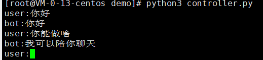

# 中文README [English README](#introduction)

## 简介
   Broca是一个轻量的对话系统框架，在设计和实现上借鉴了rasa框架，但比rasa更轻量，应该也更容易使用。

## 安装

把代码克隆到本地，然后可通过以下命令进行安装：

    python setup.py install

然后通过pip 安装依赖：

    pip install -r requirements.txt

## 快速上手
    
在命令行输入以下命令初始化一个项目：
 
    broca init --project_name demo
然后可看到一个初始化的项目模板，目录结构如下：


初始化项目包含了一个初始的agent，在agent目录下，其中agent_config.json是该agent的配置文件，skills.py用于定义该agent的技能。engine_config.json是对话引擎的配置文件，engine.py中定义了对话引擎。intent_patterns.json包含句子模板和意图的对应关系。

我们通过实现两个简单技能来完成一个简单的demo，编辑agent/skills.py，加入以下代码：
```python
from Broca.task_engine.skill import Skill


class GreetSkill(Skill):
    def __init__(self):
        super().__init__()
        self.name = "greet_skill"
        self.trigger_intent = "greet"
        self.intent_patterns = ["hi", "hey", "hello"]

    def _perform(self, tracker):
        self.utter("hi", tracker.sender_id)
        return []


class IntroductionSkill(Skill):
    def __init__(self):
        super().__init__()
        self.name = "introduce_skill"
        self.trigger_intent = "what_can_you_do"
        self.intent_patterns = ["what can you do?"]

    def _perform(self, tracker):
        self.utter("I can talk with you.", tracker.sender_id)
        return []
```
接着我们可以通过运行engine.py来测试我们的demo：



## Introduction

Broca is a tiny dialogue system framework, which borrows some idea from the rasa framework in its design and implementation. While its more light-weight and easier to to use, I bet.

## Installation

    python setup.py install
    pip install -r quirements.txt

## Quickstart

Iinitializa a project by typing the following command:

    broca init --project_name demo
then a directory named demo which contains the project template will be generated. The directory tree is as follows:


The project contains an initial agent, which is defined in the 'agent' directory. 'engine_config.json' is the configuration file of the task engine; 'engine.py' defines the task engine;
'intent_patterns.json' defines the mapping of the intents and patterns.  
We now finish our demo by implementing two simple skills. Edit the skills.py as follows:
```python
from Broca.task_engine.skill import Skill


class GreetSkill(Skill):
    def __init__(self):
        super().__init__()
        self.name = "greet_skill"
        self.trigger_intent = "greet"
        self.intent_patterns = ["hi", "hey", "hello"]

    def _perform(self, tracker):
        self.utter("hi", tracker.sender_id)
        return []


class IntroductionSkill(Skill):
    def __init__(self):
        super().__init__()
        self.name = "introduce_skill"
        self.trigger_intent = "what_can_you_do"
        self.intent_patterns = ["what can you do?"]

    def _perform(self, tracker):
        self.utter("I can talk with you.", tracker.sender_id)
        return []
```

Then we can test our demo just by running engine.py.  


