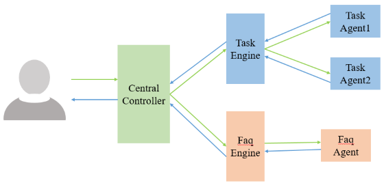

# 中文README [English README](#introduction)

## 简介
   Broca是一个轻量的对话系统框架，如下图所示，该框架包含任务引擎和Faq引擎，同时支持任务对话和Faq对话。
当接受用户的消息时，中控组件负责将消息分发给任务引擎或faq引擎。任务引擎在设计和实现上借鉴了rasa框架，
但比rasa更轻量，也更容易使用，可以支持多个agent。Faq Agent基于语义匹配技术实现，可实现问题准确又高效的检索。

   

## 安装

把代码克隆到本地，然后可通过以下命令进行安装：

    python setup.py install

然后通过pip 安装依赖：

    pip install -r requirements.txt

## 快速上手
    
在命令行输入以下命令初始化一个项目：
 
    broca init --project_name demo
然后可看到一个初始化的项目模板，目录结构如下：


初始化项目包含了一个初始的agent，在agent目录下，其中agent_config.json是该agent的配置文件，skills.py用于定义该agent的技能。engine_config.json是对话引擎的配置文件，engine.py中定义了对话引擎。intent_patterns.json包含句子模板和意图的对应关系。

我们通过实现两个简单技能来完成一个简单的demo，编辑agent/skills.py，加入以下代码：
```python
from Broca.task_engine.skill import Skill


class GreetSkill(Skill):
    def __init__(self):
        super().__init__()
        self.name = "greet_skill"
        self.trigger_intent = "greet"
        self.intent_patterns = ["hi", "hey", "hello"]

    def _perform(self, tracker):
        self.utter("hi", tracker.sender_id)
        return []


class IntroductionSkill(Skill):
    def __init__(self):
        super().__init__()
        self.name = "introduce_skill"
        self.trigger_intent = "what_can_you_do"
        self.intent_patterns = ["what can you do?"]

    def _perform(self, tracker):
        self.utter("I can talk with you.", tracker.sender_id)
        return []
```
接着我们可以通过运行engine.py来测试我们的demo：


