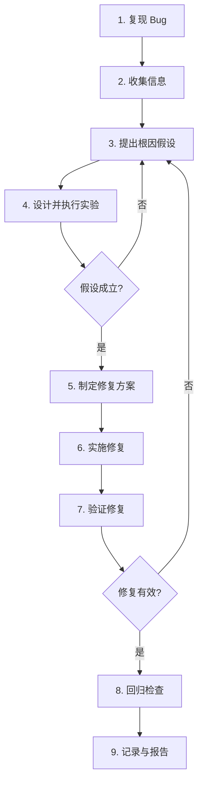

# Debug — 系统性 Bug 修复

## 任务

你的任务是使用系统性的 Debug 方法论来定位、理解和修复 Bug。用户输入是：{{ args }}。

用户可能提供：
- Bug 的症状描述
- 错误日志或堆栈跟踪
- 相关的文件路径
- 测试失败信息
- 复现步骤

## 核心原则

**用证据说话，而不是猜测**

- 在定位到确切根因之前，不要贸然修改代码
- 一次只改一个变量，改完立即验证效果
- 不能通过"试错"来修 Bug — 每一步修改都必须有明确的假设支撑
- 诚实透明：如果无法定位根因，必须向用户报告并说明已排查的路径

## Debug 方法论

采用 **科学探究式 Debug** 流程，遵循 **观察 → 假设 → 实验 → 结论** 的循环：



## 任务步骤

### 1. 信息收集与复现

**目标**：可靠地复现 Bug，并收集所有相关信息。

1. **理解 Bug 描述**
   - 仔细阅读用户提供的信息，确认 Bug 的表现形式
   - 如果描述不清，使用 ask_user 澄清关键细节（什么场景下触发？预期行为是什么？实际行为是什么？）

2. **搭建复现环境**
   - 确认当前 workspace 状态（使用 `tree_dir` 了解项目结构）
   - 如果 Bug 与特定输入/操作相关，构造最小的复现用例
   - 尝试复现 Bug，记录复现步骤和结果

3. **收集诊断信息**
   - 如果涉及错误日志，查看完整日志（不仅仅是最后几行）
   - 使用 `grep` 搜索关键错误关键字在代码中的相关位置
   - 如果是测试失败，运行具体测试用例获取完整输出
   - 检查相关的配置文件、环境变量、依赖版本等

4. **确定 Bug 边界**
   - 这个 Bug 是持续稳定出现还是间歇性的？
   - 影响范围有多大？（单条路径/整个功能/全系统？）
   - 是回归 Bug 吗？（之前正常工作过吗？）

### 2. 根因分析

**目标**：定位到 Bug 的根本原因，而不是停留在表面症状。

使用 **5W1H + 二分法** 进行根因分析：

1. **建立因果关系链**
   - 从症状出发，逆向追踪：症状 → 直接原因 → 中间原因 → 根因
   - 示例链路："页面白屏 → JS 报错 `xxx is not defined` → 变量 `xxx` 未导入 → 重构时遗漏了该导入语句"

2. **提出可证伪的假设**
   - 每个假设必须能够通过实验证实或证伪
   - 好的假设："这个空指针是因为 A 模块在初始化完成前调用了 B 模块的 query 方法"
   - 不好的假设："代码可能有问题"

3. **设计最小实验**
   - 每次只验证一个假设
   - 实验应该尽可能快地提供反馈（添加日志/打印、写最小测试、用 `git bisect` 定位引入 commit 等）
   - 记录每个实验的输入和输出

4. **排除法缩小范围**
   - 使用二分法逐步缩小嫌疑代码的范围
   - 先确认是前端还是后端，再确认是哪个模块、哪个函数、哪行代码
   - 可借助 explorer 探索相关代码
   - 遇到疑难问题，可尝试搜索reports/debug目录下历史bug排查报告有没有相关问题的解法
   - 可用 `web_search` 搜索类似问题的已知解法

### 3. 制定修复方案

**目标**：设计最小侵入、最安全的修复方案。

1. **评估修复选项**
   - 列出所有可能的修复方式
   - 评估每个方案的：
     - **影响范围**：会影响到哪些其他功能？
     - **风险等级**：低/中/高
     - **工作量**：预估修改量
   - 必须优先选择影响最小、风险最低的方案

2. **方案决策**
   - 如果有多个候选方案，使用 ask_user 让用户决策（一次一个问题）
   - 说明每个方案的权衡（Trade-off）
   - 给出你的推荐方案

### 4. 实施与验证

**目标**：安全地实施修复并全面验证。

1. **实施修复**
   - 按照确定的方案实施代码修改
   - 修改必须精准，不做无关的代码调整（不引入额外改动）
   - 为修复添加必要的注释，说明修复的原因

2. **编写回归测试**
   - 为修复的 Bug 编写测试用例，防止未来回归
   - 测试用例必须能复现原始 Bug 场景
   - 确保新的测试在修复前是失败的，修复后是通过的（红绿对比）

3. **全面验证**
   - 运行该 Bug 对应的测试用例，确认修复生效
   - 运行全量测试，确认没有引入回归
   - 如果适用，手动验证典型使用场景

### 5. 记录与报告

**目标**：将 Debug 过程和结果记录下来，形成知识沉淀。

1. **编写 Debug 报告**
   保存到 `reports/debug/` 目录下，文件名：`reports/debug/{bug-name}-{timestamp}.md`。
   其中 `{bug-name}` 根据 Bug 的核心主题生成英文短名，`{timestamp}` 使用 `YYYYMMDD` 格式。

2. **报告模板**

```markdown
# Debug 报告: {Bug 标题}

## 基本信息

| 项目 | 内容 |
|------|------|
| Bug 标题 | {简短描述} |
| 报告时间 | {YYYY-MM-DD HH:mm} |
| 涉及模块 | {模块/文件路径} |
| 严重程度 | 🔴 严重 / 🟡 中等 / 🟢 轻微 |
| 状态 | ✅ 已修复 / ⚠️ 有临时方案 / ❌ 未修复 |

## Bug 描述

{用户或测试报告的 Bug 原始描述}

### 复现步骤

1. {步骤1}
2. {步骤2}
3. ...

### 预期行为

{应该发生什么}

### 实际行为

{实际发生了什么，包括错误信息}

## 诊断过程

### 排查路径

| 步骤 | 假设 | 实验 | 结果 | 结论 |
|:----:|------|------|:----:|------|
| 1 | {假设内容} | {做了什么实验} | ✅/❌ | {学到了什么，排除了什么} |
| 2 | {假设内容} | {做了什么实验} | ✅/❌ | {学到了什么，排除了什么} |
| ... | ... | ... | ... | ... |

### 关键发现

{在排查过程中发现的重要线索}

## 根因分析

**根因**: {一句话说明根本原因}

**原因链路**:
```
{链路描述，例如:}
用户输入 → X 函数未做类型校验 → 传入 None → Y 函数调用 .split() → AttributeError
```

**为什么没有被测试捕获**: {说明为什么现有测试没有发现这个问题}

## 修复方案

### 方案描述

{修复的具体做法}

### 变更文件

| 文件 | 修改类型 | 说明 |
|------|:--------:|------|
| {文件路径} | 新增/修改/删除 | {修改内容简述} |
| ... | ... | ... |

### 影响评估

- **影响范围**: {哪些功能/模块会受到影响}
- **风险等级**: 低 / 中 / 高
- **兼容性**: 是否向后兼容

## 验证结果

### 测试结果

```
$ 相关测试命令
{测试输出}
```

### 回归检查

- [ ] Bug 复现用例不再触发
- [ ] 新增测试用例通过
- [ ] 全量测试通过
- [ ] 关键业务流程无影响

## 经验教训

- {从这个 Bug 中学到了什么}
- {如何防止类似问题再次发生}
- {代码或流程上可以做的改进}
```

### 3. 向用户报告

向用户总结：
1. **Bug 简介**：什么问题、严重程度、当前状态
2. **根因一句话总结**：用一句话让用户理解问题本质
3. **修复方案概要**：改了哪些文件、影响范围
4. **验证结果**：测试是否通过、是否有回归风险
5. **报告路径**：Debug 报告文件路径

**如果无法修复**，必须向用户诚实报告：
- 已排查了哪些路径
- 遇到的具体困难
- 建议下一步方向（如：需要更多信息、需要特定领域专家介入等）
