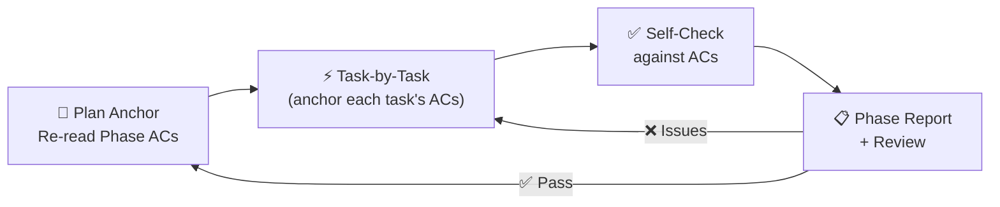

# Execute Tasks

Execute tasks that were created by the `create-tasks` skill from a plan document.

## The Complete Workflow

```
create-plan (skill)          → plans/*.md              (plan document)
create-tasks (skill)         → Task Management         (actionable task hierarchy)
execute-tasks (skill)        → implement Phase N       (implementation only)
user                         → tests + review report
```

## Core Principles

### Principle 1: Own the Quality

- No missing work items. Never leave TODOs unimplemented.
- No cutting corners. Implement strictly according to the plan.
- Be honest and transparent. If something can't be done, report it.
- Test thoroughly before reporting completion.

### Principle 2: Plan Anchoring — The Plan is the Constitution

**The plan document is your sole source of truth. All execution must align with it strictly.**

- Before each phase and each task, **re-read the corresponding section** of the plan document (context may have been compressed).
- If any plan description is unclear, **must use `ask_user` to confirm** — never fill in the blanks yourself.
- If you believe a better approach exists, **propose it via `ask_user`** and get approval before changing course.

### Principle 3: Acceptance Criteria Are the Only Measure of Done

**A task is complete only when ALL its acceptance criteria are satisfied.**

- No lowering the bar to "close" a task.
- No adding unrequested features (scope creep).
- If a technical blocker prevents meeting an AC, **report to the user** — let them decide whether to adjust the standard.

## Core Methodology

**Work in continuous delivery cycles: one phase at a time.**



## Execution Workflow

Each Phase follows a 5-step cycle:

```
┌──────────────────────────────────────────────────┐
│  Step 5.1: Phase Anchor (re-read plan)           │
│  Step 5.2: Task Execution Loop (per task)        │
│  Step 5.3: Phase Self-Check                      │
│  Step 5.4: Integration Check                     │
│  Step 5.5: Phase Report + Review                 │
└──────────────────────────────────────────────────┘
```

---

### Step 1: Phase Anchor

At the start of each phase, **re-read the plan document** for this phase:

- The **phase goal** and **phase acceptance criteria**
- Every Task's: **goal**, **steps**, **expected output**, **acceptance criteria**
- Confirm no tasks are missed or misremembered

> Why re-read? Context may have been compressed. Re-reading ensures your execution stays anchored in the latest, most complete plan content.

---

### Step 2: Task Execution Loop

#### Discover Tasks

Tasks created by `create-tasks` follow the naming convention `{PlanName} / Phase {N}: {Name}` and `{PlanName} / Task {N.M}: {Name}`. Find them by plan name:

```json
// Search by plan name to discover all tasks for a plan
{ "action": "search", "query": "{PlanName}" }

// Or, if the master task ID is already known, get the full hierarchy
{ "action": "get_children", "task_id": "MASTER_TASK_ID" }
```


#### Select Next Task

Choose the next task based on:

| Criteria         | Rule                                                                      |
| ------------------| ---------------------------------------------------------------------------|
| **Status**       | Must be `pending` (or `blocked` if unblocking)                            |
| **Dependencies** | All dependency task IDs must have status `completed`                      |
| **Priority**     | Higher priority first (high > medium > low)                               |
| **Plan order**   | Follow Phase/Task number order (Phase 1 → Task 1.1 → 1.2 → Phase 2 → ...) |

#### Task Anchor
- Re-read the task's goal, steps, expected output, and **acceptance criteria**
- Be crystal clear on "what counts as done"

#### Implement
- Follow the plan's steps strictly
- **After each logical block, check against ACs**: "Am I moving toward satisfying the criteria?"
- If the plan doesn't cover a situation, **use `ask_user`** — never decide alone
- **No scope creep**: don't add features the plan doesn't ask for

#### Task-Level Verification
- Manually verify each AC against the implementation
- **The task is done only when ALL its ACs are satisfied**

#### Deviation Detection
After completing the task, ask yourself:
> "Does the implementation match the plan's description?"
- If deviation found: **stop immediately**, use `ask_user` to report the deviation, get instructions before continuing

```json
// Mark task as in_progress
{
    "action": "update",
    "task_id": "TASK_ID",
    "status": "in_progress"
}

// Mark task as completed — keep report CONCISE, save details for phase report
{
    "action": "update",
    "task_id": "TASK_ID",
    "status": "completed",
    "report": "Done: {brief summary}. ACs verified: {list}. Tests: {N} passed."
}
```

> **Task report = concise.** Just a brief summary of what was done and which ACs passed. Detailed analysis, test outputs, and deviations go into the **phase report** (Step 5.5).

**Tips**: Use todo_management to trace the process of task execution.

---

### 3: Phase Self-Check

After all tasks in the phase are complete:

- **Verify every phase-level acceptance criterion** — one by one
- **Verify every task-level acceptance criterion** — one by one
- Check for **missing tasks** (compare against the plan's task list)
- Check for **extra functionality** (nothing should exist that the plan didn't ask for)
- Run all tests (unit + integration) and confirm they pass

> The core question: **"Does everything the plan requires for this phase exist, and does it work correctly?"**

---

### Step 4: Integration Check

Integrate the phase's results with existing work:

- Does new code integrate with existing code?
- Are APIs backward-compatible?
- Do all existing tests still pass?

---

### Step 5: Phase Report + Review

This is the **detailed report** — in contrast to concise task reports, the phase report captures everything:

1. Write a **detailed phase report** to `plans/reports/execution/{plan-name}-phase-{N}.md`
2. Use the Phase Report Template below — include deviation explanations, AC-by-AC outcomes
3. Present the report:
- For manual review (by default), just provide the report location to the user and inform that `review_execution` command  can be used for report review, then **stop and wait for the user's review decision.** Never be verbose. (Your report contains all details)
- If user specifies to use auto-review, assign the review task to `assistant`(task: "review execution report: {report path}").

> ⚠️ **Do not auto-proceed to the next phase.** You must wait for the review result. Only if the user explicitly says "proceed" or "continue all phases" should you move on.

**Review outcomes:**
- ✅ **Pass (user approves)** → Proceed to the next phase (back to Step 5.1)
- ❌ **Issues found (user requests fixes)** → Fix each issue → Update report → Re-submit for review
- 🏁 **User says "complete all phases"** → Continue through remaining phases without pausing for review after each

## The 3-Strike Error Protocol

When encountering errors during execution:

```
ATTEMPT 1: Diagnose & Fix
  → Read task details carefully
  → Identify what's blocking
  → Apply targeted fix
  → Update task with resolution notes

ATTEMPT 2: Alternative Approach
  → Same error? Try a different method
  → NEVER repeat the exact same failing action

ATTEMPT 3: Broader Rethink
  → Review the approach fundamentally
  → May need more investigation

AFTER 3 FAILURES: Escalate
  → Explain what was tried
  → Share the specific error
  → Add comment to task with attempts
  → Mark task as "blocked"
  → Ask user for guidance
```

```json
// Escalation pattern
{
    "action": "add_comment",
    "task_id": "TASK_ID",
    "content": "3-Strike Protocol triggered.\n\nAttempt 1: {what was tried}\nResult: {error}\n\nAttempt 2: {what was tried}\nResult: {error}\n\nAttempt 3: {what was tried}\nResult: {error}\n\nRequesting user guidance."
}
{
    "action": "update",
    "task_id": "TASK_ID",
    "status": "blocked"
}
```

## Deviation Handling

If you discover any inconsistency between the plan and what you're doing, **handle it immediately** — do not proceed and assume it's fine.

```
Deviation Detected
   │
   ├── Minor Ambiguity (plan description is unclear)
   │     └── Use ask_user to confirm: "The plan says XXX, I understand it as YYY, is that correct?"
   │
   ├── Technical Blocker (plan approach is not feasible)
   │     └── Use ask_user to report: "Plan approach XXX hits issue YYY. Suggest A (impact: ...) or B (impact: ...). Please decide."
   │
   └── Optimization Found (plan can be improved)
         └── Use ask_user to propose: "Plan approach XXX can be improved to YYY (benefit: ..., risk: ...). OK to adjust?"
```

> **When in doubt, ask_user. Better to ask before proceeding than to discover the wrong direction after completion.**

## Phase Report Template

**Unlike task reports (which should be concise), phase reports are detailed.** This is where you document everything: test results, deviation explanations, AC-by-AC verification evidence.

Write phase reports to `plans/reports/execution/{plan-name}-phase-{N}.md`.

```markdown
# {Plan Title} — Phase {N}: {Phase Name} — Execution Report

## Overview

| Item | Content |
|------|---------|
| Plan File | {plan file path} |
| Phase | Phase {N}: {Phase Name} |
| Status | ✅ Pass / ⚠️ Partial / ❌ Fail |

## Plan Anchor Confirmation

- [ ] Re-read the plan document section for this phase before starting
- [ ] Acceptance criteria for each task confirmed

## Task Completion

| Task | Status | Plan ACs | Actual Result | Deviation |
|:----:|:------:|----------|---------------|-----------|
| Task {N}.{M}: {Name} | ✅/⚠️/❌ | {list ACs from plan} | {how each AC was met} | {if any} |
| ... | ... | ... | ... | ... |

> ✅ = All ACs met, ⚠️ = Partial (reported), ❌ = Not completed

## Deviations

{If any deviation from plan, describe: what, why, and whether user approved}

## Quality Checklist

- [ ] All phase-level ACs satisfied
- [ ] All task-level ACs satisfied
- [ ] No missing tasks (cross-referenced against plan)
- [ ] No extra functionality (only what the plan asked for)
- [ ] Manually verified key behaviors
- [ ] Code follows project conventions
- [ ] Compatible with existing work
```

## Task Management Queries

### Get Task Details
```json
{ "action": "get", "task_id": "TASK_ID" }
```

### Get Tasks by Plan Name
```json
{ "action": "search", "query": "{PlanName}" }
```

### Get Subtasks of a Phase
```json
{ "action": "get_children", "task_id": "PHASE_TASK_ID" }
```

## Plan Task Reference

Tasks created by `create-tasks` follow this structure:

| Task Name Pattern                 | Meaning           | What to Expect in `details`            |
| -----------------------------------| -------------------| ----------------------------------------|
| `{PlanName} / Phase {N}: {Name}`  | Phase parent task | Phase goal, phase ACs                  |
| `{PlanName} / Task {N.M}: {Name}` | Individual task   | Steps, expected output, plan reference |

The task's `files` array will contain `["plans/{plan-name}.md"]` — use this to locate the plan document for anchoring.

The task's `details` field will contain:
- **Steps**: Concrete steps to follow
- **Expected Output**: What success looks like
- **Plan Reference**: Path back to the plan document

## Anti-Patterns

| Don't                                 | Do Instead                                                         |
| ---------------------------------------| --------------------------------------------------------------------|
| Skip reading the plan document        | Always re-read the relevant plan section for context               |
| Skip acceptance criteria verification | Verify EVERY acceptance criterion before marking complete          |
| Ignore dependencies                   | Check all dependencies are completed before starting               |
| Repeat failed approaches              | Log failures, try different methods, use 3-Strike Protocol         |
| Work on tasks out of plan order       | Follow Phase/Task numbering from the plan                          |
| Skip progress tracking                | Update status → in_progress → completed with report                |
| Write verbose task-level reports      | Keep task reports concise; put details in the phase report instead |
